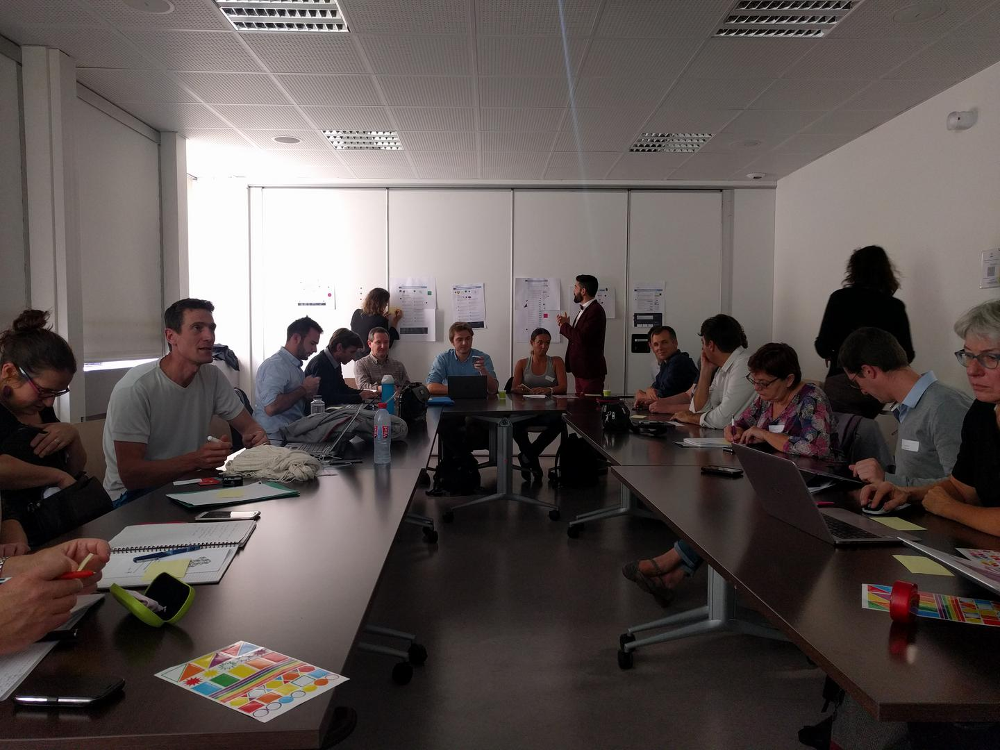
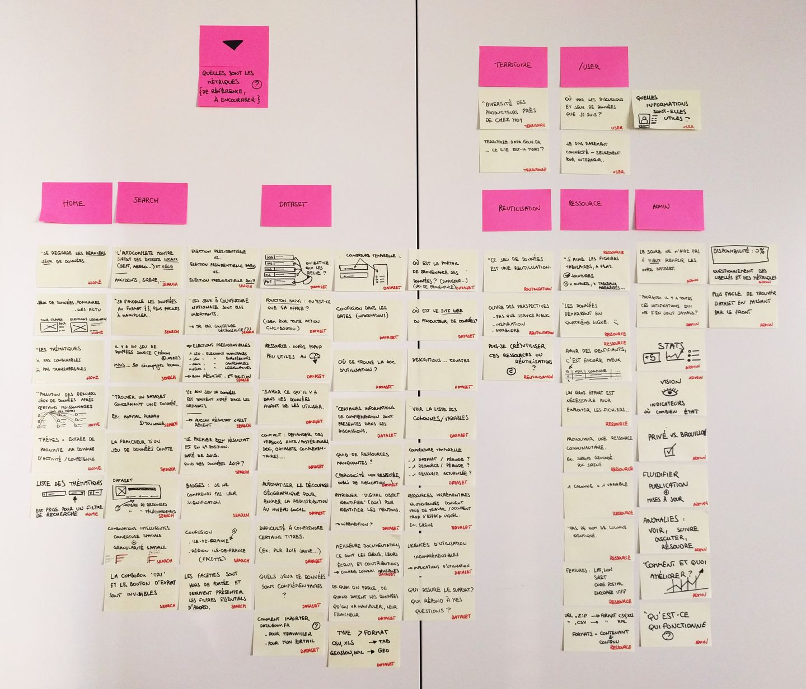

# Recherche utilisateur

> 🎤 Entretiens avec des utilisateurs et utilisatrices de [data.gouv.fr][datagouv] et de l'Open Data pour **aboutir à une meilleure compréhension des usages** et pour **réduire les efforts de réutilisation des données**.

# Entretiens de groupe

## Workshop « prototype de téléchargement de sous-ensemble géographique »

Cet atelier a réuni une _trentaine de personnes_ lors de l'événement [Restitution intermédiaire publique Opendata Locale #2](http://www.opendatafrance.net/2017/09/05/restitution-intermediaire-publique-opendatalocale-2/) avec un public de collectivités, associations, institutions, éditeurs et entreprises.

📝 [Consulter la méthode et les résultats du workshop](workshops/20171004-opendatalocale/index.md)

## Forum Open d’État à Nantes

Cet atelier a réuni une vingtaine de personnes le 13 septembre 2018. Il s’inscrivait dans un cadre plus large, celui du quatrième forum Open d’État organisé à Nantes, dont nous avons parlé [sur le blog d’Etalab](https://www.etalab.gouv.fr/opengov-forum-open-detat-4-cuisinez-les-algorithmes-un-outil-de-mediation-numerique).

👀 [Consulter le compte-rendu de Mathilde sur l’atelier](workshops/20180913-open-etat-nantes/index.md)

# Entretiens en face à face

## Juillet-septembre 2017

| | | |
| --- | --- | --- |
| Trouver un dataset plus facilement | Comprendre les frustrations  | Être au contact des communautés |
| Enlever des features inutiles | Déveloper des features utiles | Savoir quoi montrer des datasets |

Cette première série d'entretiens est destinée à faire émerger des éléments relatifs à ces 3 hypothèses :

1. la **découvrabilité** des données est semée d'embûches ;
2. la **compréhension** des données n'est pas évidente ;
3. la **réutilisation** des données est trop coûteuse.

L'enjeu est de dégager des **actions courtes à impact fort** ainsi qu'une vision synthétique des **domaines et de leurs niveaux d'enjeux**.

Consulter le transcript des entretiens avec :

* [Joel Gombin](interviews/20170711-joel/index.md)
* [Nicolas Barthe-Dejean](interviews/20170711-nicolas/index.md)
* [Pascal Romain](interviews/20170711-pascal/index.md)
* [Pierre Chrzanowski](interviews/20170713-pierre/index.md)
* [Paul-Antoine Chevalier](interviews/20170803-paul-antoine/index.md)
* [Tom Forth](interviews/20170817-tom/index.md)
* [Antoine Sirven](interviews/20170824-antoine/index.md)
* [Alexiane Lerouge](interviews/20170904-alexiane/index.md)
* [Philippe Guiraud](interviews/20170904-philippe/index.md)

Le _suivi et la planification_ des entretiens est gérée depuis ce [_board_ Trello][].

[datagouv]: https://data.gouv.fr/
[_board_ Trello]: https://trello.com/b/ENhCEfJL
