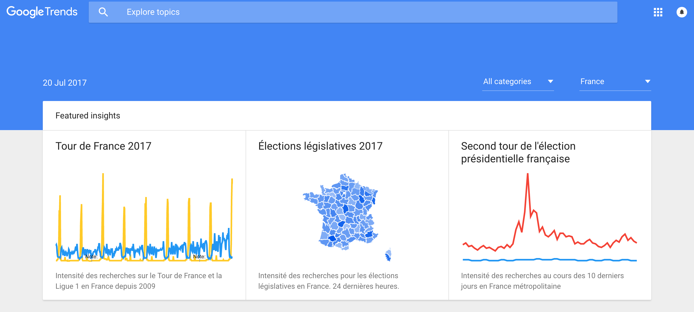

# Entretien avec Nicolas Barthe-Dejean

## Présentation

Nicolas développe l'application mobile Mediapart. Il est également impliqué dans d'autres projets dont [Hoover](https://github.com/hoover), un outil d'analyse et de recherche de documents utilisés dans le cadre de _leaks_ notamment.

L'indépendance des outils est un élément constitutif fort chez Mediapart. Plotly ou les fonds Google Maps ne sont donc pas utilisés.

[Yann Philippin](https://www.mediapart.fr/biographie/yann-philippin) nous rejoint.

## Thématique • Jeux de données utiles

Yann Philippin se focalise sur la transparence de la vie publique et sur les affaires de corruption — dont _Football Leaks_ et les _Malta Files_.

Il lui manque les jeux de données suivants :

- les [publicités foncières](https://www.service-public.fr/particuliers/vosdroits/R47483) — aujourd'hui payantes ;
- le registre du commerce ;
- les marchés publics ;
- la centralisation des rapports publics (Assemblée, Cours des Comptes, etc.)

## Thématique • Découverte des données

> On trouve facilement la donnée, via "le voisin", par exemple une carte, on suit la source.

🗣 La _source_ d'un _leak_ nous informe d'un _scoop_.

> Ça m'aurait aidé d'avoir les jeux de données liés aux entreprises, leurs données financières, les personnes physiques, les informations immobilières, leurs informations de cotation en bourse etc.

🕵️‍♀️ Prendre l'exemple de [Cash Investigation sur les produits chimiques](http://www.francetvinfo.fr/replay-magazine/france-2/cash-investigation/cash-investigation-du-mardi-2-fevrier-2016_1286821.html) : data.gouv.fr ne fournit que les informations liées aux rivières, rien à couverture nationale. Il a fallu aller chercher les chiffres de vente de certains produits chimiques achetés par les agriculteurs pour en déduire l'utilisation.

❓ Je cherche des informations sur un hôpital à Toulouse par exemple, quels jeux de données vont me donner ces informations ?

💬 Ça pourrait être intéressant d'aller montrer data.gouv.fr aux journalistes du pôle économique et social.

💬 Pareil avec Donatien, c'est lui qui fait les datavisualisations.

---

❓ Comment faire pour trouver les derniers rapports financiers de l'Autorité des Marchés Financiers (_AMF_) ?

🔗 "[Autorité des Marchés Financiers](http://www.data.gouv.fr/fr/organizations/autorite-des-marches-financiers/)"

🔗 [Archives de la base des décisions et informations financières (BDIF) de l'AMF
](http://www.data.gouv.fr/fr/datasets/archives-de-la-base-des-decisions-et-informations-financieres-bdif-de-lamf-1/)

😤 Le dernier rapport en ligne date de 2008 alors qu'il devrait y en avoir eu d'autres depuis.

---

💬 Pousser des jeux de données en fonction de l'actualité.

> Je ne sais pas si vous voyez Google Trends ? _Les Décodeurs_ rebondissent en général assez vite.

💬 Par rapport aux données électorales, on aimerait avoir le découpage géographique par (code de) canton.

🔍 "[cantons](http://www.data.gouv.fr/fr/search/?q=cantons)"

😕 Le premier "bon" résultat est en 4ème position, et date de 2015. Quid des données de 2017 ?

🔗 "[Découpage des cantons pour les élections départementales de mars 2015](http://www.data.gouv.fr/fr/datasets/decoupage-des-cantons-pour-les-elections-departementales-de-mars-2015/)"

💬 Avoir ce jeu de données mais historisé au lieu de devoir aller le chercher ailleurs, comme sur le [Géoportail](https://www.geoportail.gouv.fr/).

## Thématique • Compréhension des données

> Ça se passe beaucoup par téléphone, par contact humain, via Twitter.

> Il faut que j'arrive à voir ce qu'il y a dans les données avant de l'utiliser.

## Thématique • Utilisation des données

> Les manipulations ne sont jamais les mêmes.

👩‍🔬 On va toujours être hors des clous, car les transformations sont spécifiques à chaque dataviz, et on veut rarement faire deux fois la même dataviz.

😕 Un fichier Excel peut avoir 3 onglets par exemple.

🙂 On favorise les données JSON et GeoJSON — on les pré-transforme systématiquement.

---

> J'apprenais à utiliser [Rapid Miner](https://rapidminer.com/) pour relier et mixer les jeux de données ensemble.

---

> Quand on arrive, on ne sait jamais ce qu'on va trouver.

---

➡️ [Tesseract OCR](https://github.com/tesseract-ocr)

---

> Le plus simple c'est d'avoir un tableau de données.

> J'aime bien les données plates car ça permet de faire des jointures.

---

😤 Quand on retravaille les données des élections, elles manquent de clés uniques (homonymes sur les candidat·e·s) et les noms sont listés au niveau de chaque ligne par ordre de plébiscite.

😤 Quand ils sont orthographiés de la même manière — les accents n'y sont pas toujours (ça dépend des bureaux de vote).

## Conclusion

> Ça m'a poussé à retourner voir data.gouv.fr

> J’ai beaucoup apprécié cet échange, et j’ai hâte d’en rediscuter en interne pour pousser les gens à (re-)découvrir la plateforme.

## ROTI • Retour sur le Temps Investi

N/C
