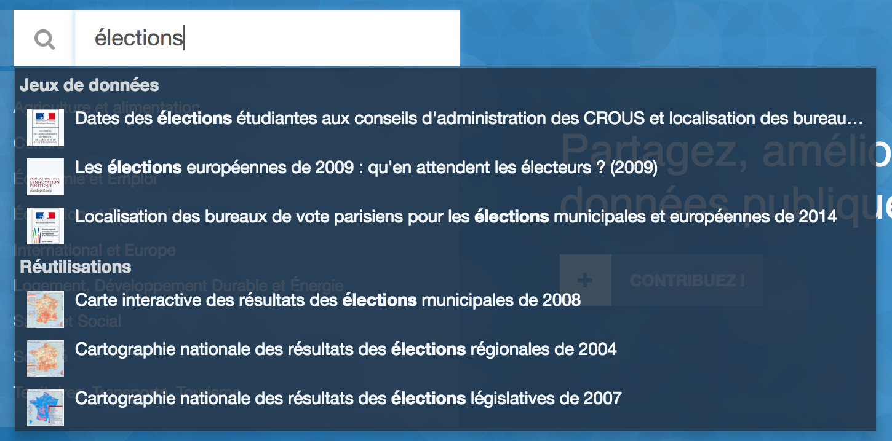
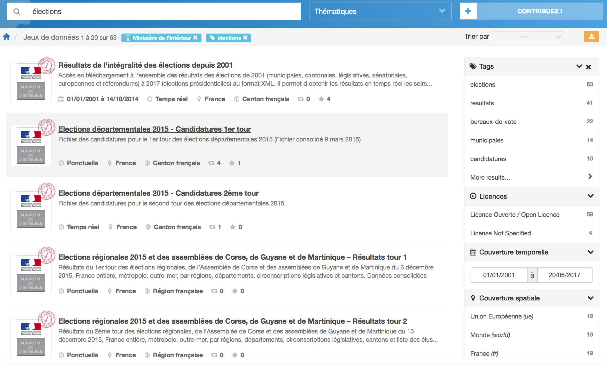
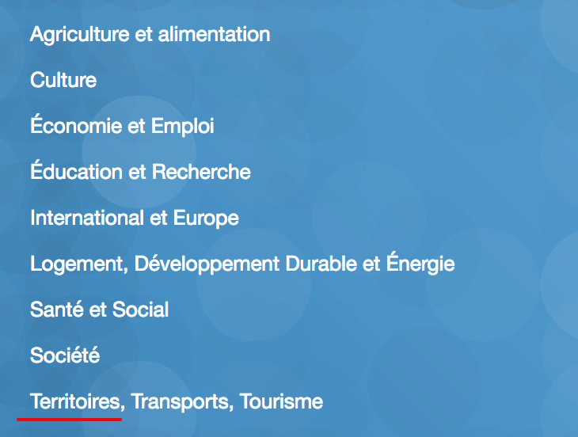
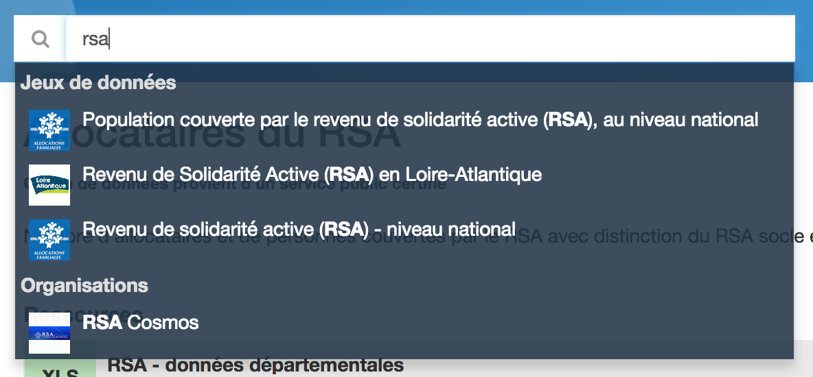
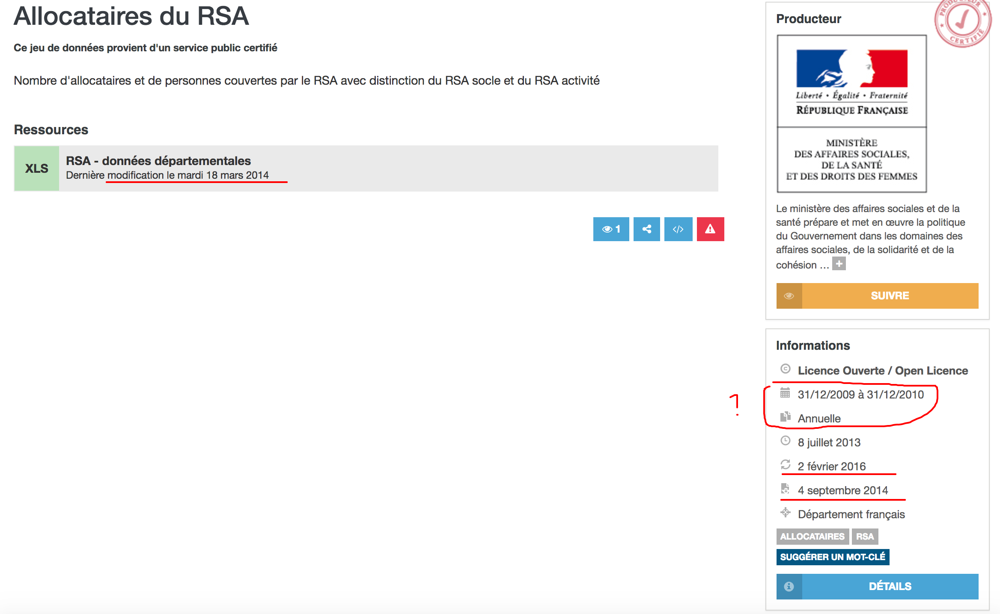
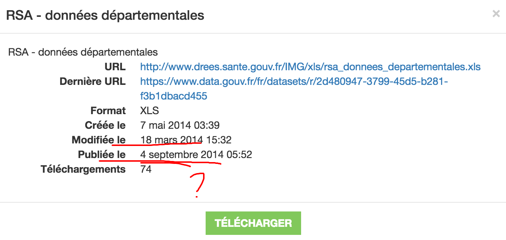
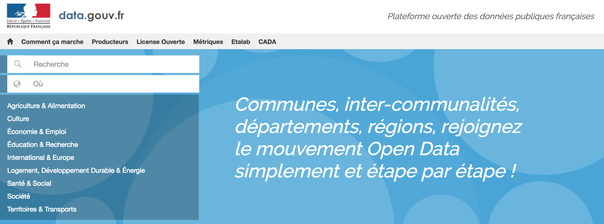
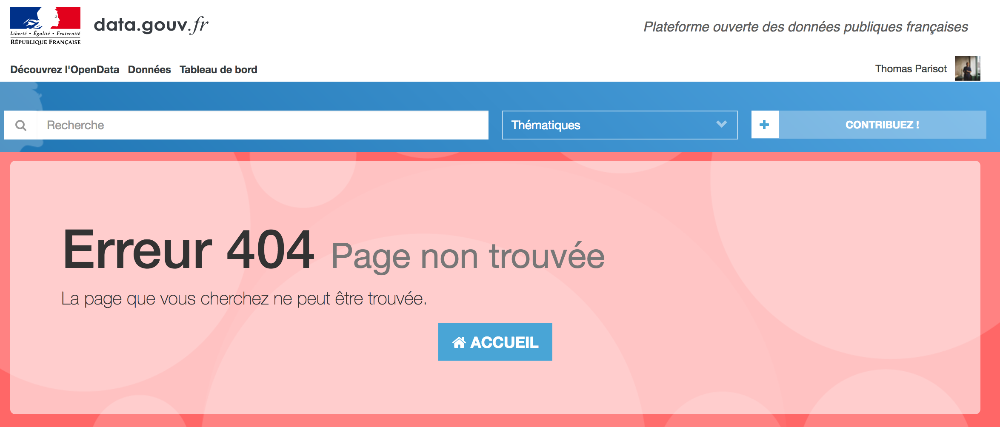
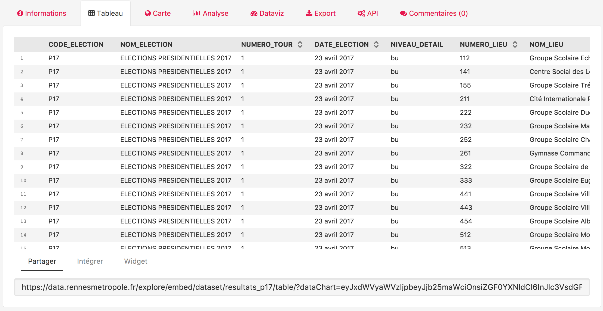
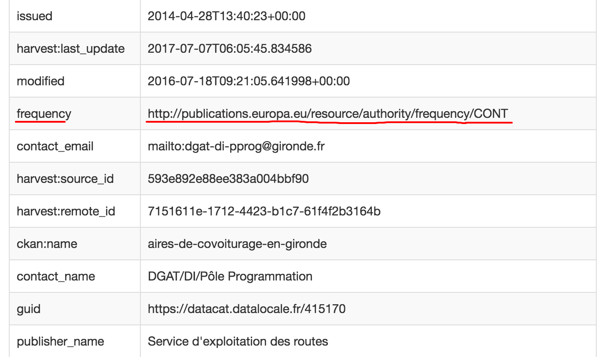

# Entretien avec Pascal Romain

## Présentation

Pascal coordonne des projets d'ouverture de données publiques et d'archivage électronique au sein du Conseil Général de la Gironde.

Pascal est co-animateur du [premier référentiel de bonnes pratiques open data](https://checklists.opquast.com/fr/opendata/) et co-responsable du site [datalocale.fr](https://www.datalocale.fr/).

## Thématique • Découverte des données

🗣 En tant qu'animateur de ressourcerie locale, un des enjeux principaux est de **trouver les jeux nationaux à portée locale** (départementale).

🔍 "[élections](http://www.data.gouv.fr/fr/search/?q=%C3%A9lections)" pour trouver les résultats des élections 

🤔 Pourquoi l'autocomplete montre des résultats aussi vieux ?

😤 Même en triant par le _producteur attendu_ et un mot-clé explicite du jeu de données, rien d'évident ne remonte.

---

❓ Est-ce qu'il y a un RSS des derniers jeux de données publiés ?

---

🤔 Les thématiques font très _organisation ministérielle_ alors qu'en réalité, la santé, le social, l'éducation (entres autres) font également partie des _Territoires_ — terme regroupant régions et départements.

---

🔍 "[RSA](https://www.data.gouv.fr/fr/search/?q=rsa)"

> Je ne sais pas si l'autocomplete affiche l'exhaustivité des résultats donc je lance la recherche quand même.

📈 Il y a 119 résultats.

> Souvent je suis obligé de fouiller.

🔗 "[allocataires du RSA](https://www.data.gouv.fr/fr/datasets/allocataires-du-rsa-30378531/)"

🤔 La couverture temporelle et le détail des dates sont confus — la date de publication est plus récente que la date de création — la date de modification est antérieure à la date de création.

❓ Est-ce qu'il ne faudrait pas remplacer par un jeu de données historicisé, ou bien avoir une ressource par année ?

😤 Le fichier est 404 alors que la resource est indiquée comme existante.

💬 Les données affichées dans la popup _Détails_ n'est vraiment utile que si on souhaite la référencer dans son propre catalogue.

> Le fichier national est alimenté par des données fournies par la Gironde — ça me permet de vérifier le calcul national/départemental de versement du RSA.

---

> J'utilisais de temps en temps [territoire.data.gouv.fr](http://territoire.data.gouv.fr/)

💬 J'aimerais bien pouvoir automatiser le découpage géographique pour animer la redistribution au niveau local.

😕 Toutes les recherches mènent à data.gouv.fr

😕 Les thématiques mènent à des 404.

❓ Le site est-il mort ?

## Thématique • Compréhension des données

❓ Pourquoi le [vocabulaire Eurovoc](http://eurovoc.europa.eu/) n'est-il pas utilisé pour les tags ? (au lieu d'avoir recours à de la saisie libre)

---

> Je ne peux savoir ce qu'il y a dans un jeu de données que lorsque je l'ai téléchargé.

💬 Juste avoir l'intitulé des colonnes m'aiderait.

💬 En gros, voir les données, peut-être pouvoir les filtrer. Un peu comme Rennes et le jeu de données des _élections présidentielles 2017_ ?

---

💬 La fraîcheur d'un jeu de données compte.

💬 Et comprendre ce qu'il y a à l'intérieur d'un jeu de données (notice d'utilisation etc.)

💬 Mais aussi avoir accès à un point de contact : demander où sont les versions antérieures, demander ce que veut dire tel ou tel champ, y'a-t-il d'autres données complémentaires/intéressantes en lien avec tel jeu de données ?

🤔 Je me serais attendu à un point de contact. Je me sens distant — pas certain de la qualité de l'offre des données. Les formats sont assez ésotériques. Certains liens ne fonctionnent pas.

> [Sur une page de jeu de données] tiens par exemple, en quoi cette ressource PDF est liée aux autres ressources listées au-dessus et au-dessous ?

---

❓ Ça fait quoi quand je me mets à _suivre_ un producteur ?

❓ Je peux savoir si des jeux de données ont été mis à jour, ou ajoutés en rapport avec une thématique donnée ?

---

💬 Ah tiens, je republie quelque chose qui vient de chez eux. Pourtant je **perds** la notion de diffuseur.

🔗 Cf. [Orthophotographie de la métropole de Bordeaux](https://www.data.gouv.fr/fr/datasets/orthophotographie-de-la-metropole-de-bordeaux1/)

ℹ️ data.gouv.fr offre un jeu de données de référence, _forké_/_republié_ ailleurs et indexe la republication lors du moissonnage — le lien de parenté semble perdu.

---

> Je ne sais pas trop quelle est la pérennité d'un jeu de données s'il n'y a pas une base d'utilisateurs.

## Thématique • Utilisation des données

💬 Je nettoie les données des jeux nationaux non-liées au territoire (ex: la Gironde) et j'ajoute quelques colonnes si nécessaire (notamment des détails géographiques).

---

💬 En général je 

1. Renomme les colonnes (Open Data Soft/CKAN n'aiment pas les doublons de noms) ;
1. Rajoute latitude et longitude (pour avoir les prévisualisations de cartes sur CKAN)

---

🔗 "[Les départs en retraite des personnels](https://www.data.gouv.fr/fr/datasets/les-departs-en-retraite-des-personnels/)"

🤔 C'est un fichier Excel, pas un format ouvert.

😤 Et en plus je dois "activer les macros".

⚠️ Ce jeu de données est en réalité une _réutilisation_ (graphique et statistiques résumées)

> Je ne sais pas trop ce que je vais pouvoir faire avec ça.

## Thématique • Contributions

> J'ai sollicité un moissonnage mais il est toujours en erreur.

> Celui-là est en échec mais c'est _normal_, c'est un _catalogue_.

> Ah, là y'a une erreur mais c'est une _stack trace_ Python…

---

💬 L'identifiant distant du dataset est mentionné mais je suis obligé de reconstruire l'URL à la main — on ne pourrait pas avoir un lien hypertexte pour ça ?

---

😕 Des personnes me contactent — cf. Notifications en haut à droite de l'admin — mais je ne le sais pas car je n'en suis pas notifié par email.

---

> Là j'ai un score de 4, là un score de 8 mais là depuis la liste, ça ne me pointe pas vers ce qui pourrait me permettre d'améliorer les jeux de données.

✍️ Aires d'autoroute en Gironde

😯 Ah tiens, il manquait des informations de license

🤔 Maintenant que j'ai ajouté la licence et que je suis sur la page admin du dataset, quel est mon score ?

😕 Pourquoi suis-je mal noté alors que j'utilise un vocabulaire normalisé pour certaines informations ?

## Conclusion

N/C

## ROTI • Retour sur le Temps Investi

N/C
