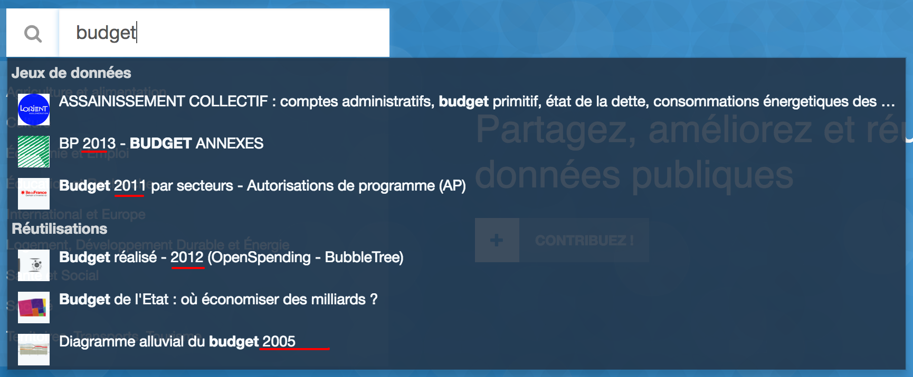
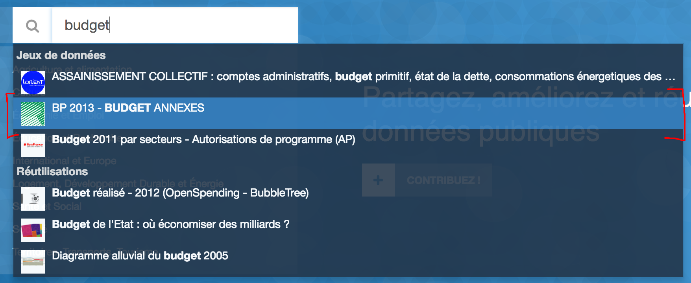
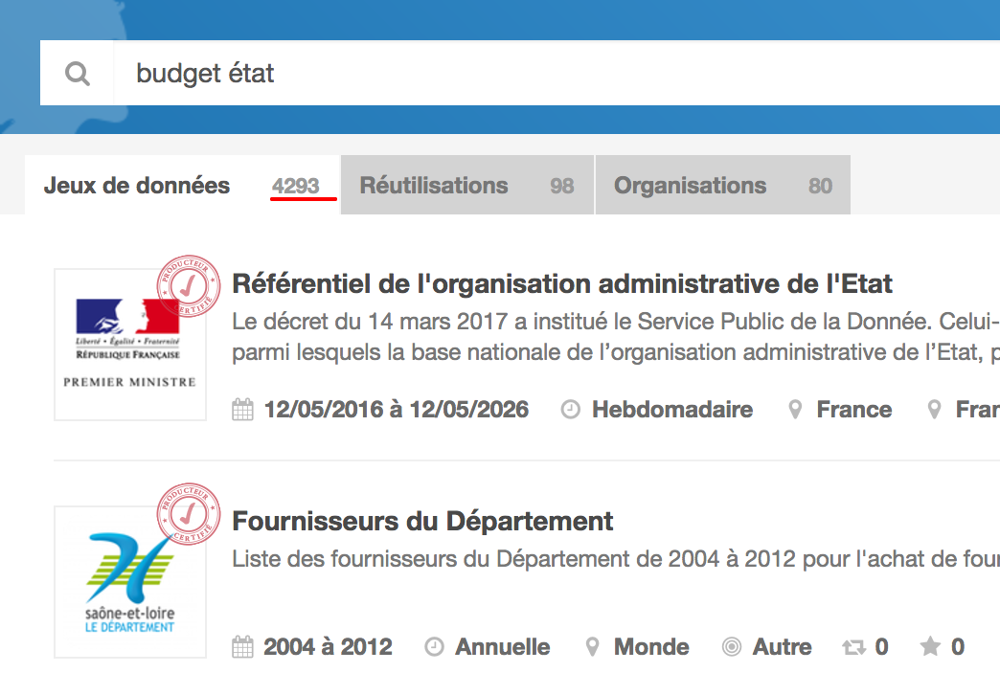
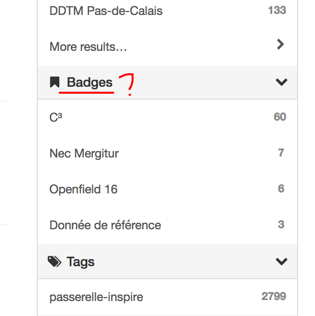
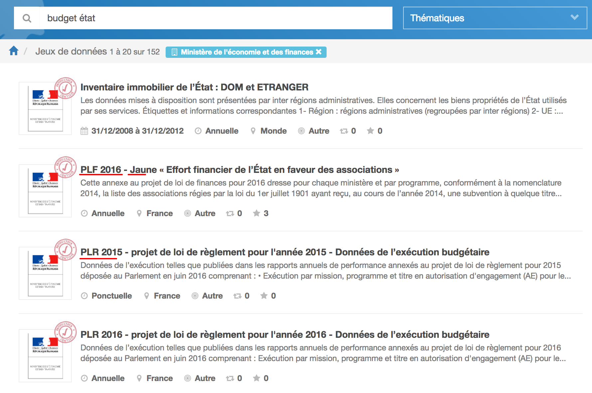
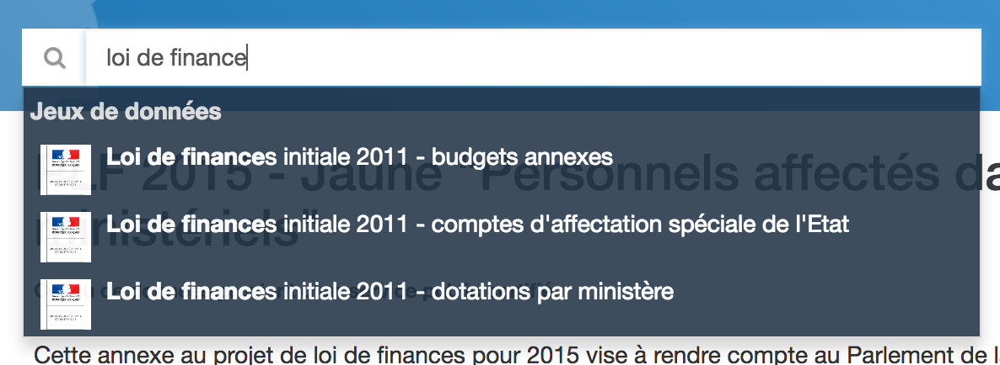
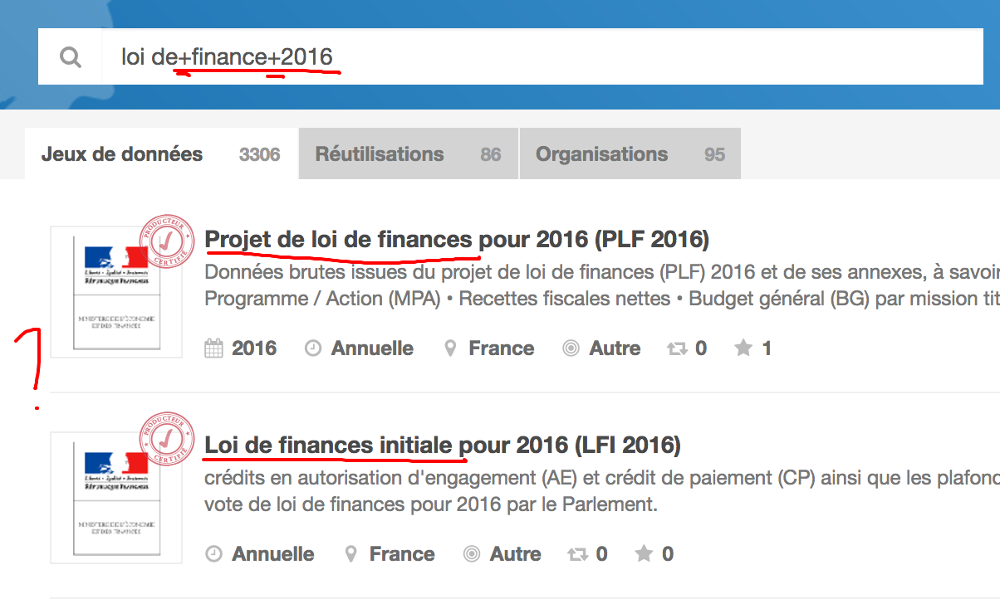
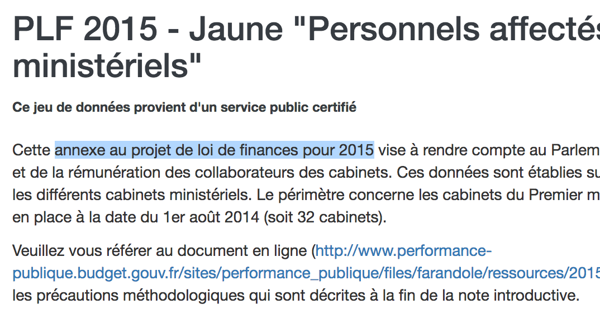
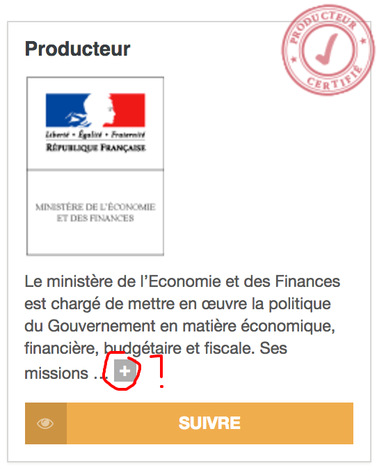
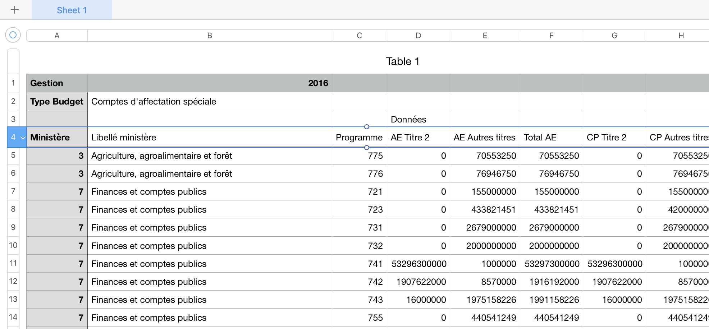

# Entretien avec Pierre Chrzanowski

## Présentation

Pierre travaille dans le monde de l'Open Data depuis 2010 environ. Il a commencé comme chargé du numérique à l'ambassade de France à Londres lors de l'élaboration de [data.gouv.fr](https://www.data.gouv.fr/fr/).

Pierre a participé à la production d'un rapport sur l'Open Data au Royaume-Uni, animé des conférences autour du sujet ce qui a par la suite mené à créer [Open Knowledge Foundation France](https://fr.okfn.org/).

Par la suite, il s'est focalisé sur l'accompagnement de pays et d'organisations à mettre en place des initiatives d'Open Data ainsi qu'à comprendre les utilisateurs, notamment pour le compte de la _Banque Mondiale_.

## Thématique • Découverte des données

🗣 Utilisation de data.gouv.fr principalement pour l'alimentation d'[Open Data Index](https://index.okfn.org/place/fr/) — à savoir 15 jeux de données qui doivent être **nécessairement de qualité**.

> Je ne suis pas un utilisateur de données publiques. Plutôt un observateur, consultant, travaillant à leur **mise en commun**.

---

🔍 "[budget](https://www.data.gouv.fr/fr/search/?q=budget)"

> Je ne fais pas confiance à l'autocomplete car les propositions sont vieilles.

❗️ D'ailleurs en validant le formulaire, ça ne lance pas la recherche mais emmène vers le jeu de données précédemment survolé.

❗️ Et une fois survolé, il est impossible de le désélectionner.

🔍 "[budget état](https://www.data.gouv.fr/fr/search/?q=budget+%C3%A9tat)"

😨 4293 résultats, j'en fais quoi ?

❓ Ils veulent dire quoi les badges ?

➡️ Cherche MinéFi / DGFip dans les facettes _parce que je sais_ qu'ils peuvent produire les données du budget.

❓ Je suis censé savoir à quoi correspondent les titres ?

---

🔍 "[loi de finance 2016](https://www.data.gouv.fr/fr/search/?q=loi+de+finance+2016)"

😯 Rien de récent.

😤 Rien du tout (en autocomplete).

(On lance la recherche)

> On choisit lequel ?

🔗 [Loi de finances initiale pour 2016 (LFI 2016)](https://www.data.gouv.fr/fr/datasets/loi-de-finances-initiale-pour-2016-lfi-2016/)

😯 18 ressources, ça fait beaucoup ! Combien je fais pour savoir quel est le budget voté pour Etalab dedans ?

---

👍 On a réussi à trouver la donnée même si ça aurait pu être plus facile.

## Thématique • Compréhension des données

🔗 "[PLF 2015 - Jaune "Personnels affectés dans les cabinets ministériels"](https://www.data.gouv.fr/fr/datasets/plf-2015-jaune-personnels-affectes-dans-les-cabinets-ministeriels/)"

> Ce n'est que maintenant que je comprends qu'il y a _10 ressources_ associées à un jeu de données.

> Je n'ai pas assez de connaissances sur le budget pour comprendre ce qui est produit.

🤔 Ah, _projet de loi de finance_. Ce n'est qu'une annexe ? Je dois faire une nouvelle recherche pour trouver des données budgétaires.

---

🔗 [Loi de finances initiale pour 2016 (LFI 2016)](https://www.data.gouv.fr/fr/datasets/loi-de-finances-initiale-pour-2016-lfi-2016/)

> Il manque des métadonnées.
> Il manque des données de référence.

❓ Elle est où cette liste ? 

❓ Comment comprendre la structure du budget

😯 Ah tiens il manque la licence.

🤔 Le reste ne me dit pas grand chose pour comprendre.

❓ Il se passe quoi si je clique sur le "+", ça déplie le reste de la description ?

(Clic sur le "+")

> Ah zut, qu'est-ce que je viens de faire ?

❗️ Il manque un jeu de données annexe pour comprendre.

💬 Je _sais_ qu'il existe sur le site du Ministère des Finances _mais_ il faut que je fasse l'effort de, et il n'est pas traitable par des machines.

❓ Il est où le lien vers le site du Ministère des Finances d'ailleurs ?

> Il y'a certains jeux de données qui sont critiques à l'utilisation de la plate-forme ; notamment ceux des entreprises et relatifs à l'activité économique.

* Le Danemark a le concept de [Basic Data](https://www.digst.dk/~/media/Files/English/Grunddata_UK_web_05102012_Publication.pdf) ([via](https://www.digst.dk/Servicemenu/English/Digitisation/Basic-Data))
* La France a le [Service Public de la Donnée](https://www.data.gouv.fr/fr/reference)

---

> Pour chaque secteur d'activité, les producteurs de données sont les _administrations publiques_, _le monde privé_ ainsi que les _associations_.
> Elles produisent toutes des _données clés_.

## Thématique • Utilisation des données

🗣 Les données employées sont souvent destinées à être croisées avec celles d'autres pays.

🔗 [Loi de finances initiale pour 2016 (LFI 2016)](https://www.data.gouv.fr/fr/datasets/loi-de-finances-initiale-pour-2016-lfi-2016/)

> Ah tiens, quand je double-clique sur le fichier CSV, Excel se lance mais sans faire le _distingo_ des colonnes.

😤 Les données démarrent en quatrième ligne.

😕 Je n'ai pas d'aide pour comprendre comment manipuler les données.

> C'est impossible de comprendre si on n'est pas _expert_.

> Il y a plein de fichiers différents et autant de manières différentes de les exploiter — peu se ressemblent.

> Les fichiers sont ouverts mais pas utilisables sans fournir _un gros effort_ ; sans compter qu'on n'est que peu aidé dans le processus de réutilisation.

---

> Pourquoi c'est si compliqué de réutiliser la donnée ? C'est parce que l'_Open Data n'a jamais été la cible des Systèmes Informatiques_ d'où la donnée provient.

ℹ️ Systèmes Informatiques ➡️ Monde extérieur ➡️ Web

> **Le Web est le Système Informatique des réutilisateurs**.

> Quid des Systèmes Informatiques eux-même ? C'est là qu'est l'impact de la réutilisation.

💬 D'ailleurs ça m'aiderait si je pouvais prendre contact avec les producteurs.

---

> Je ne parlerai même pas du format PDF…

---

1. Il me faut un temps de compréhension
  * Titre des colonnes
  * Nettoyage des colonnes pour qu'elles aient toutes le même format de données
2. S'il y a des identifiants pour les lignes/valeurs de colonnes c'est encore mieux (cf. Problèmes liés au génome car il manque les identifiants les gênes)

> Tiens, prends _Open Data Soft_ avec ses jeux de données prêts à être réutilisés.

---

> Par exemple avec la Banque Mondiale et le comptage de l'aide publique.
> Combien est dépensé par les bailleurs de fond en Open Data et Systèmes d'information ?
> Combien est dépensé pour de l'activisme Open Source ?
> _Difficile_ à savoir aujourd'hui — tous les dépôts de données utilisent des taxonomies différentes.

ℹ️ [IATI (International Aid Transparency Initiative)](http://www.aidtransparency.net/)

---

> Prends l'exemple des _Panama Papers_, qui est une _fuite_ combinée à de l'Open Data.
> Sans les _listes d'entreprises_, ça n'était pas faisable.

💬 Ça serait bien de connaître la liste des bénéficiaires global des entreprises.

## Conclusion

> Avant, seuls celles et ceux qui avaient de l'argent pouvaient faire ce travail [de réutilisation des données].
> Avec l'Open Data c'est devenu un pot commun.

## ROTI • Retour sur le Temps Investi

- 👍 Entretien traduit le changement **vers des données de qualité**.
- 👍 Ça m'a fait réfléchir.
- 🤔 Peut-être mieux préciser/définir les artéfacts de l'entretien lors de l'introduction.