# Paul-Antoine Chevalier

## Présentation

* Formation d'économiste/statisticien
* Observé le développement de data.gouv.fr depuis 2012/2013, en participant notamment à la [soirée de redesign de data.gouv.fr](https://fr.okfn.org/2013/07/16/dataredesign-une-nuit-pour-imaginer-les-portails-open-data-de-nos-reves/)
* Utilise data.gouv.fr
	* En tant que **datajournaliste**
	* Puis en tant que **datascientist**, depuis 2014

## Thématique • Découverte des données

La page d'accueil est utilisée à des fins de **veille**, pour une utilisation à moyen/long terme.

😤 La lecture est parfois rendue difficile après un moissonnage chez un producteur très actif/ayant effectué une mise à jour en masse.

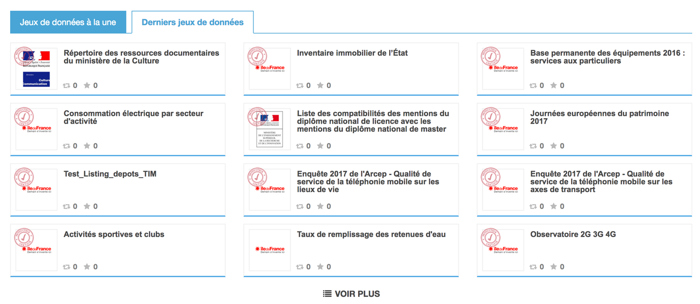

👍 J'utilise le lien **Voir plus** du cartouche _Derniers jeux de données_ sur la page d'accueil en guise de raccourci pour les derniers datasets.

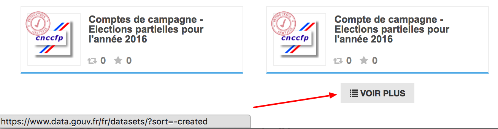

> Je peux obtenir les mêmes résultats en cliquant sur `Données > Jeux de données` puis en **triant** par _date_.

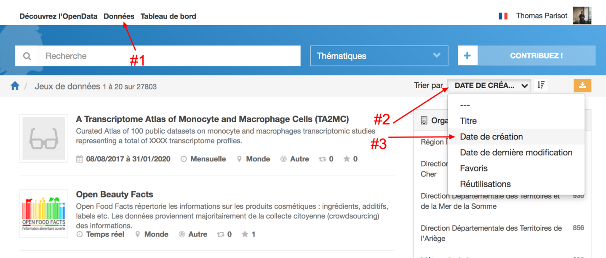

---

Prenons une recherche faite récemment.

🔍 "[vols de véhicule oise](https://www.data.gouv.fr/fr/search/?q=vols+de+v%C3%A9hicule+oise)"
1. ✅ Facette **Couverture spatiale** > Oise (60)
2. ✅ Tri **Date de création**

> Je ne me souviens plus la recherche que j'ai faite pour trouver les résultats, mais ça n'a pas été évident à cause de la **couverture géographique**.

---

Prenons un autre exemple de **couverture géographique**.

🔍 `Données > Jeux de données`

 1. ✅ Facette **Couverture spatiale** > Hauts-de-Seine (92)

😤 On se retrouve principalement avec des résultats de la ville de Meudon.

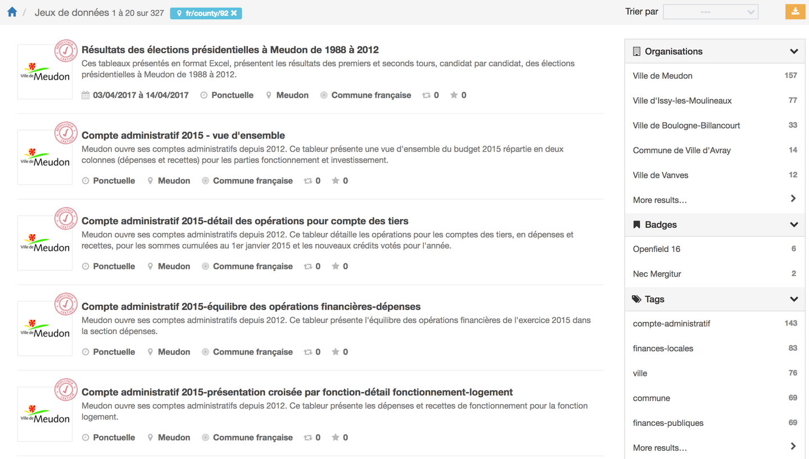

> Si je veux des résultats de Meudon, je cherche Meudon et non Hauts-de-Seine.

💬 Idéalement, quand on sélectionne un département, la priorité d'affichage serait donnée aux données couvrant au maximum cette **couverture** (etc.)

---

🔍 "[radar](https://www.data.gouv.fr/fr/datasets/?q=radar)"

1. ✅ Facette **Couverture spatiale** > France

😤 Le troisième résultat concerne la région de Bretagne

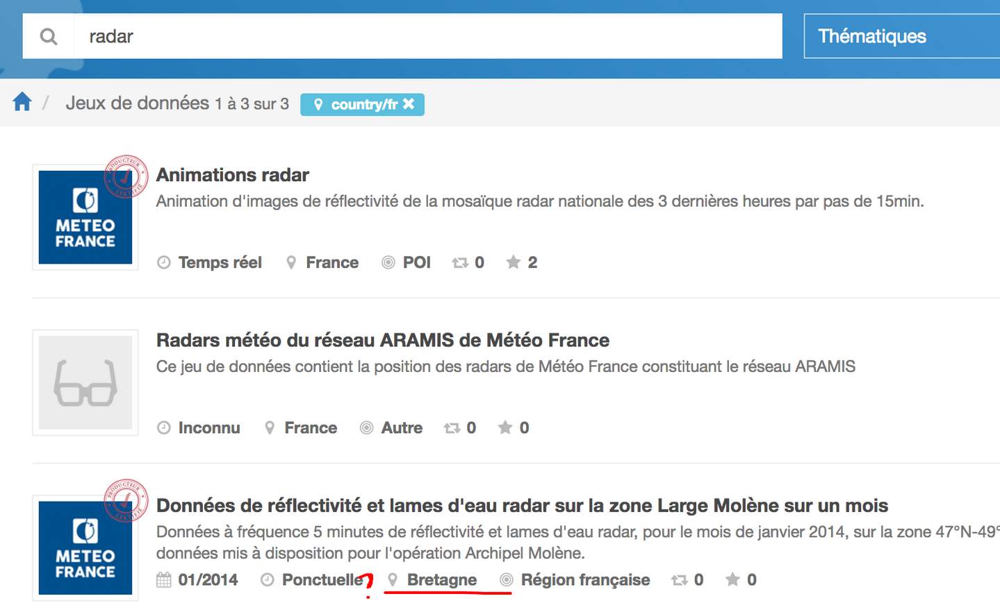

❓ Que veux dire _couverture spatiale_ ?

---

🔍 "[infogreffe](https://www.data.gouv.fr/fr/search/?q=infogreffe)"

🤔 Pourquoi est-ce qu'on n'a _que_ les données de la Région Île-de-France ?

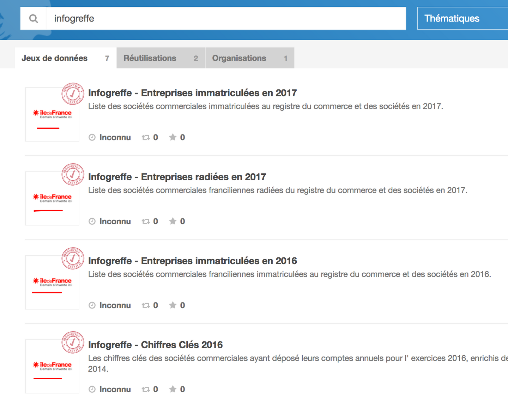

❗️ Il fallait cliquer sur l'onglet `Organisations` pour voir les _32 jeux de données_ d'Infogreffe.

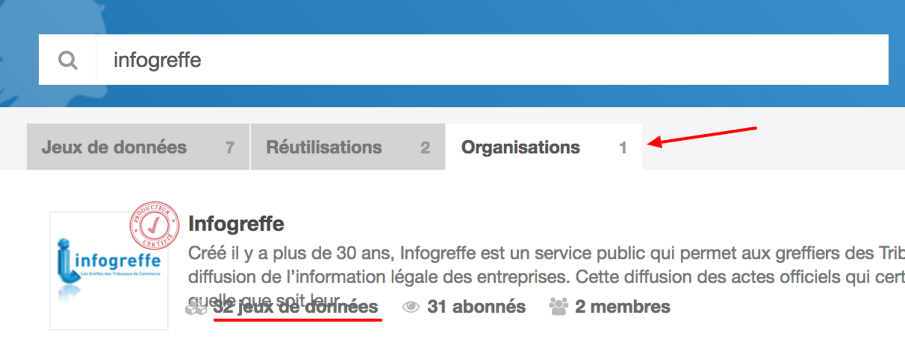

> En général je tape un peu vite donc je n'attends pas/je n'ai pas le temps de voir les résultats de l'_autocomplete_.

> Je ne suis pas sûr que l'_autocomplete_ et les _résultats de recherche_ soient les mêmes.

---

🔍 "[opendamir](https://www.data.gouv.fr/fr/search/?q=opendamir)"

🤔 aucun résultat

😅 il manquait un _espace_

🔍 "[open damir](https://www.data.gouv.fr/fr/search/?q=open+damir)"

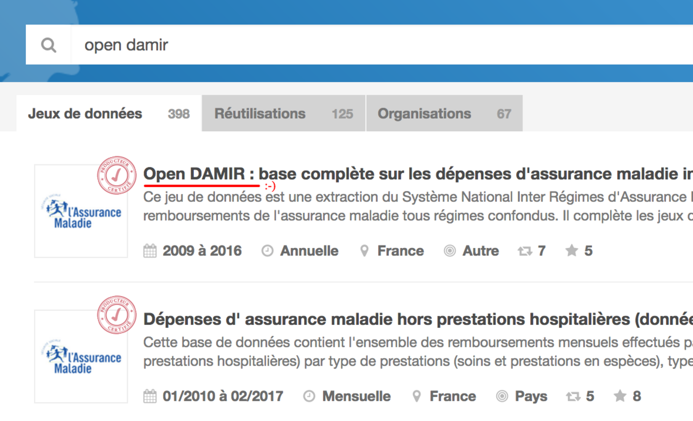

---

😤 Je n'ai aucun moyen de chercher des données qui correspondent à la France entière.

---

🔗 [Organisation Infogreffe](https://www.data.gouv.fr/fr/organizations/infogreffe/)

👀 Prenons par exemple le dataset "[chiffres clés 2016](https://next.data.gouv.fr/fr/datasets/chiffres-cles-2016/)"

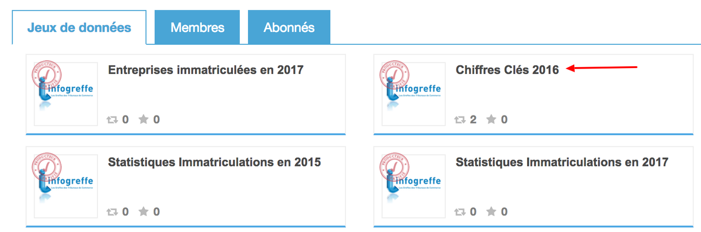

> Le libellé _chiffres clés 2016_ ça parle pour l'organisation peut-être — moins pour de la recherche. On voudrait plutôt lire _chiffres clés des entreprises en 2016_.
> Idem quand on lit _budget gouvernement_ ; ça devrait être _budget du gouvernement français_.

💬 On finirait par mettre des **normes** dans les _titres_ comme par exemple, **pas d'acronymes**. Un peu comme sur Wikipédia 

➡️ [CNIL](https://fr.wikipedia.org/wiki/CNIL) = [Commission nationale de l'informatique et des libertés (France)](https://fr.wikipedia.org/wiki/Commission_nationale_de_l'informatique_et_des_libert%C3%A9s_(France))

---

> Les _thématiques_ ? Je ne les utilise jamais.

💬 Ça serait cohérent si on avait de **l'éditorial**.

---

> Les _meilleures réutilisations_ et _dernières réutilisations_ sur la page d'accueil ? Elles ne sont pas mises à jour souvent donc je les regarde _peu_.

---

🔗 Revenons sur l'[Organisation Infogreffe](https://www.data.gouv.fr/fr/organizations/infogreffe/).

😤 Et plus spécifiquement _les chiffres clés_ : on a **plusieurs datasets** avec 1 seule ressource au lieu d'**un seul dataset** avec des **ressources historisées**.

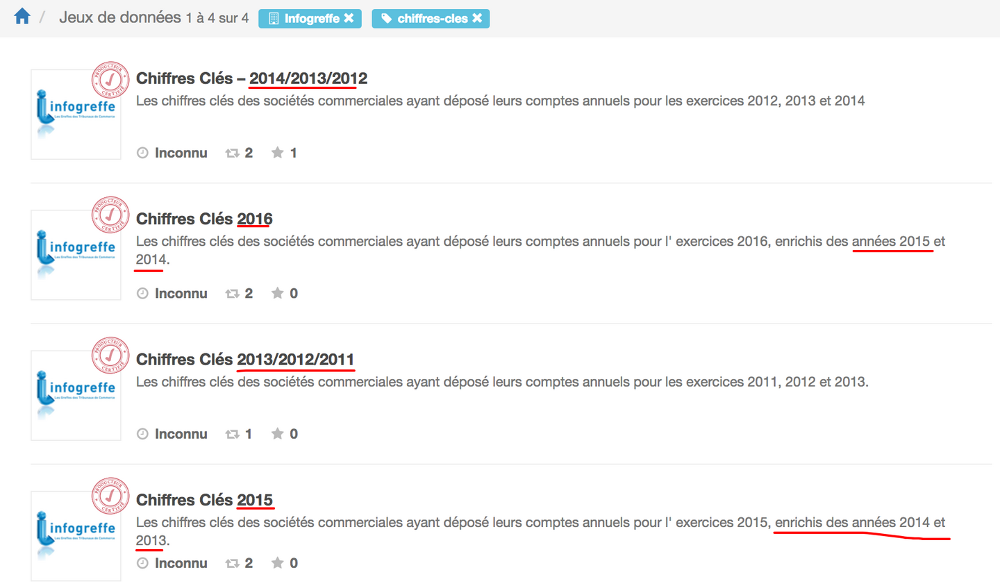

❗️ C'est pénalisant car je **galère** les retrouver et à les rassembler.

---

🔍 "[tableau de bord projets SI](https://www.data.gouv.fr/fr/search/?q=tableau+de+bord+projets+SI)"

🤔 Pas de résultat correspondant à ce que je cherche.

🔍 "[DINSIC](https://www.data.gouv.fr/fr/search/?q=dinsic)"

😅 Ah c'était _panorama_ et non _tableau de bord_.

🔗 "[Panorama des grands projets SI de l’État](https://www.data.gouv.fr/fr/datasets/panorama-des-grands-projets-si-de-letat-1/)"

## Thématique • Compréhension des données

🔗 "[Nombre d'embauches par code APE et code ROME](https://www.data.gouv.fr/fr/datasets/nombre-dembauches-par-code-ape-et-code-rome/)"

- 👍 Je vois le **nom des colonnes**, c'est important
- 👍 Le descriptif est informatif (c'est une **notice** en réalité)

> Je **télécharge** pour **voir** les données.

😤 Les métadonnées sont rarement à jour donc par défaut, je les zappe.

😯 D'ailleurs la **granularité** est incorrecte (`Autre` au lieu de `Nationale`)

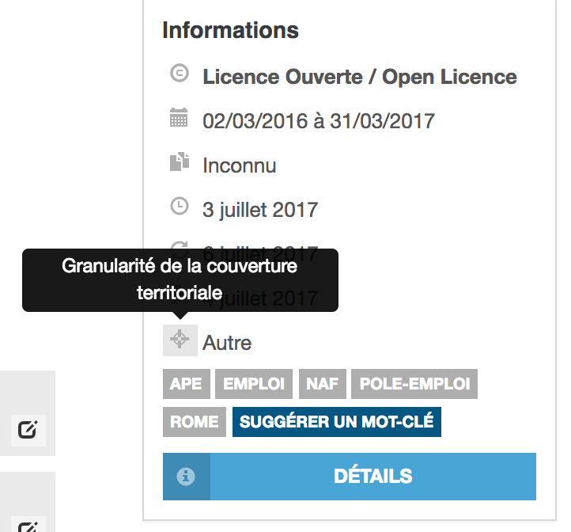

❗️ Même en étant _expert_ et en _ayant produit_ le jeu de données, on n'a pas su interpréter le sens du libellé.

---

❓ D'ailleurs les **dates de couverture ne sont pas claires** : pour un budget, elles concernent quelle année fiscale ?

---

🔗 "[Impôt de solidarité sur la fortune](https://www.data.gouv.fr/fr/datasets/impot-de-solidarite-sur-la-fortune/)"

💬 Si on avait les **variables**, on aurait **tout**. Pour des données _tabulaires_, c'est _évident_.

> S'il y a une colonne intitulée **commune**, je me dis qu'il y a **1 ligne de données par commune**.

💬 Ça serait bien avoir le nom des colonnes et quelques valeurs possibles. Comme avec `dplyr#glimpse` en R.

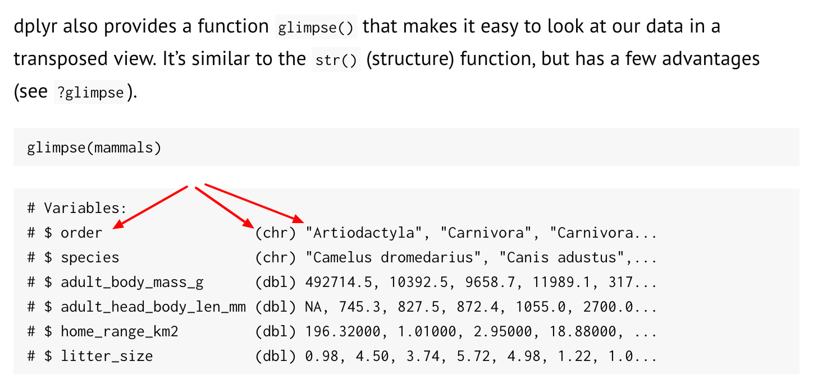

> La _vue tabulaire_ ? C'est plutôt pour **filtrer**.

💬 Si j'avais cette vue, probablement que je ne téléchargerai pas les ressources. Ça **simplifierait** beaucoup de choses.

💬 Si on avait une **sémantique**, on pourrait joindre les données plus facilement — sur le **code communes** par exemple.

---

> En tant que **datascientist**, j'ai besoin de répondre à des questions comme **la corrélation entre le taux d'abstention et les revenus**, par exemple.

➡️ J'ai utilisé un script appelé [Open-Moulinette](https://github.com/anthill/open-moulinette) pour obtenir un découpage intracommunal.

---

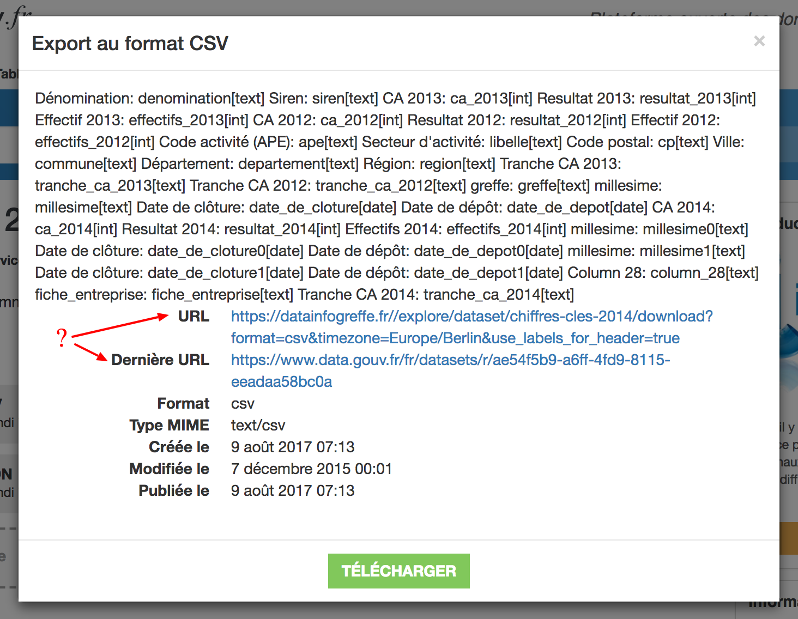

> Dans une _popup_ de **ressource de dataset**, c'est l'_URL_ qui est utile.

🤔 Je **ne comprends pas bien** la différence entre les 2 URLs.

💬 `Permalien` me paraitrait plus clair que `Dernière URL`.

🤔 En fait on a **3 fois** l'URL de téléchargement dans la _popup_, 3 clics qui sont la même chose.

> J'**aime bien** avoir l'URL en clair pour la copier.

## Thématique • Utilisation des données

- ➡️ [csvkit](https://github.com/wireservice/csvkit) ([doc](https://csvkit.readthedocs.io/))
- ➡️ [agate](https://github.com/wireservice/agate) ([doc](https://agate.readthedocs.io/))

## Thématique • Contribution des données

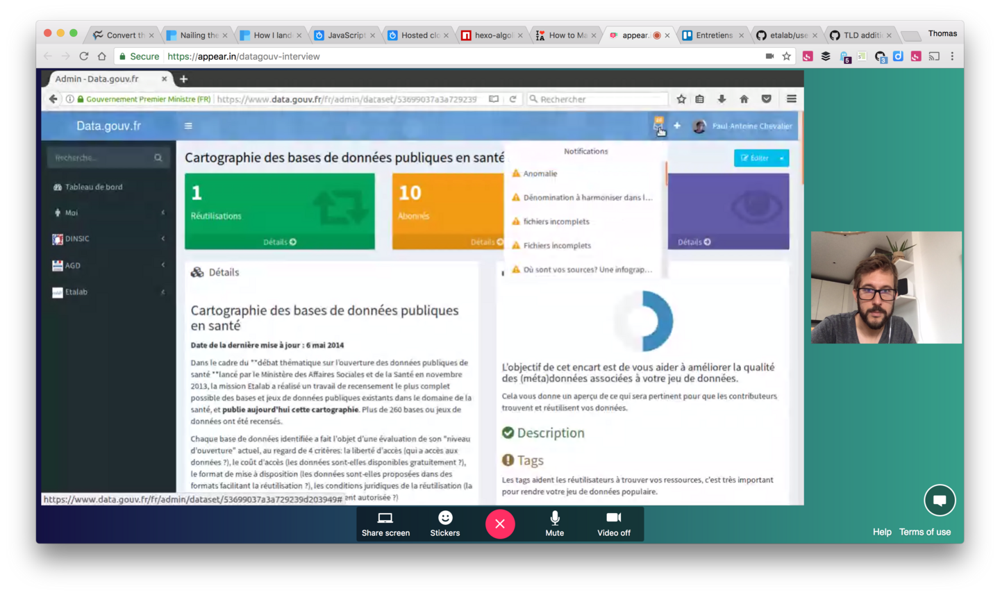

> Je **ne sais pas pourquoi** il y a toutes ces notifications.
> J'ai l'impression qu'elles ne s'en vont **jamais**.

❗️ Je n'ai **aucun endroit pour suivre les discussions** auxquelles je suis abonné ou auxquelles j'ai participé.

---

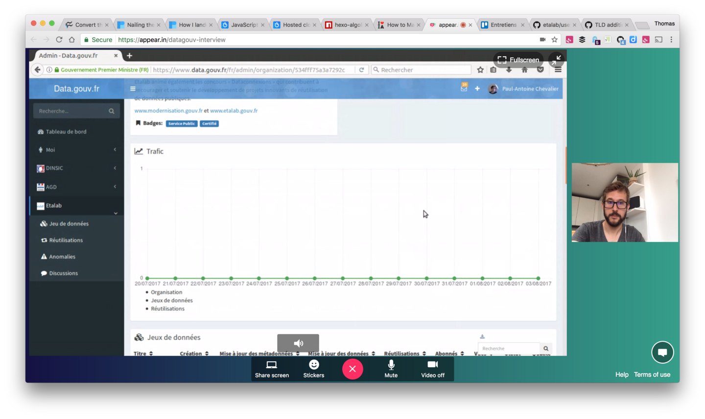

😤 Je ne **comprends pas** les chiffres.

❓ Le trafic ? Pourquoi **il n'y a rien** ?
 
🤔 Je ne sais pas trop ce que je **suis censé voir**.
 
 > J'imagine que c'est souvent à _zéro_.
 
 👍 Le tableau est déjà plus **pertinent**
 
 👍 Le tableau est beaucoup plus **lisible**
 
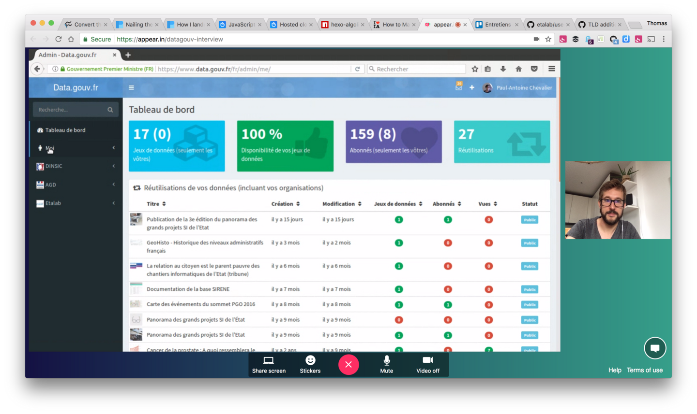

❓ D'ailleurs, **pourquoi** il y a 2 interfaces ? Ce serait des chiffres qui seraient **utiles côté _front_**.

---

 > Je me _logue_ surtout pour **suivre des jeux de données**.
 
 🗣 Mais en fait c'est un **signe d'encouragement**.
 
 💬 En réalité le _suivi_ sert peu car ça **ne prévient pas** de nouveaux datasets (cf. ressources non-historicisées).

## Thématique • Communauté des données

🗣 **On ne bénéficie pas assez de l'_intelligence_ de la communauté**.

❓ Quelles sont les incitations à contribuer ?

---

> J'ai **assez peu de réponses** à mes commentaires.

😞 Les _ressources communautaires_ ne sont **pas mises en valeur**.

🤔 La différence avec les _réutilisations_ ne sont **pas toujours claires**.

Par exemple sur 🔗 "[Base Sirene des entreprises et de leurs établissements (SIREN, SIRET)](https://www.data.gouv.fr/fr/datasets/base-sirene-des-entreprises-et-de-leurs-etablissements-siren-siret/)"

- ❓ la **version géocodée** est très utile — **comment la faire remonter** ?  
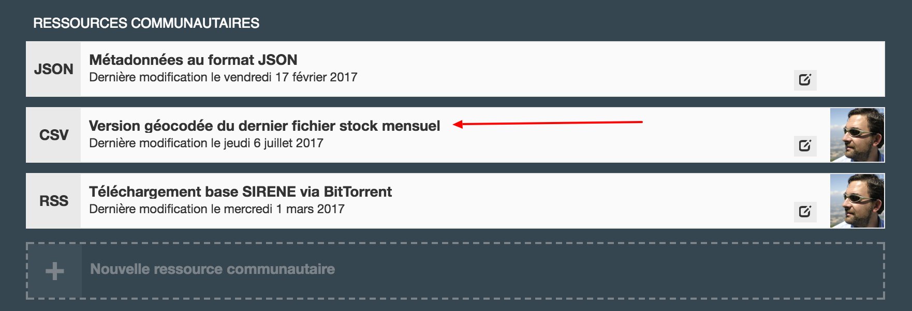
- ❓ la [documentation base SIRENE](https://www.data.gouv.fr/fr/reuses/documentation-de-la-base-sirene/), j'ai **hésité** à la classer en **documentation** ou **ressource**  
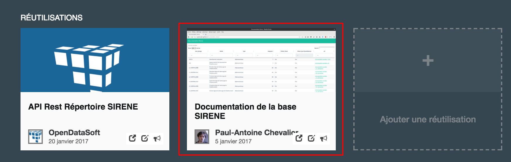

> Je regarde les **réutilisations** par curiosité, pour voir **d'autres façons** de faire.

## Conclusion

N/A

## ROTI • Retour sur le Temps Investi

> J'ai découvert des choses à propos de data.gouv.fr

> Ça me donne des idées, notamment des **formations sur l'amélioration des jeux de données** — à voir à la rentrée.