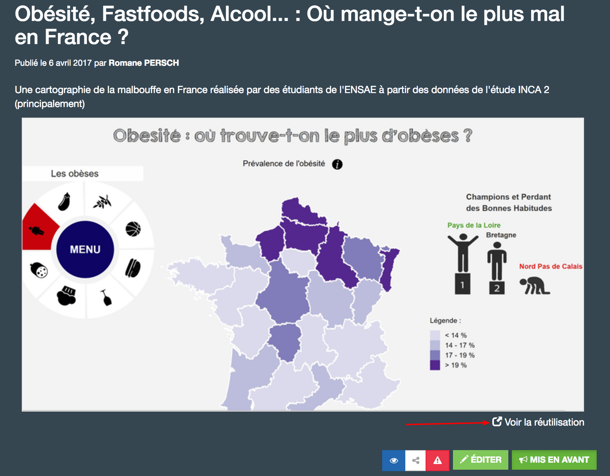
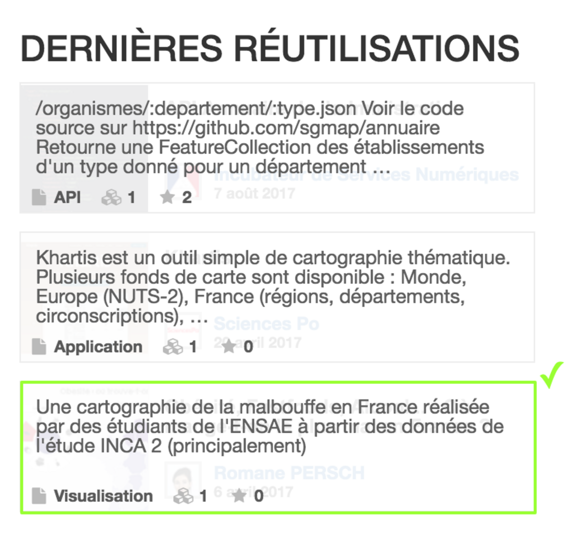
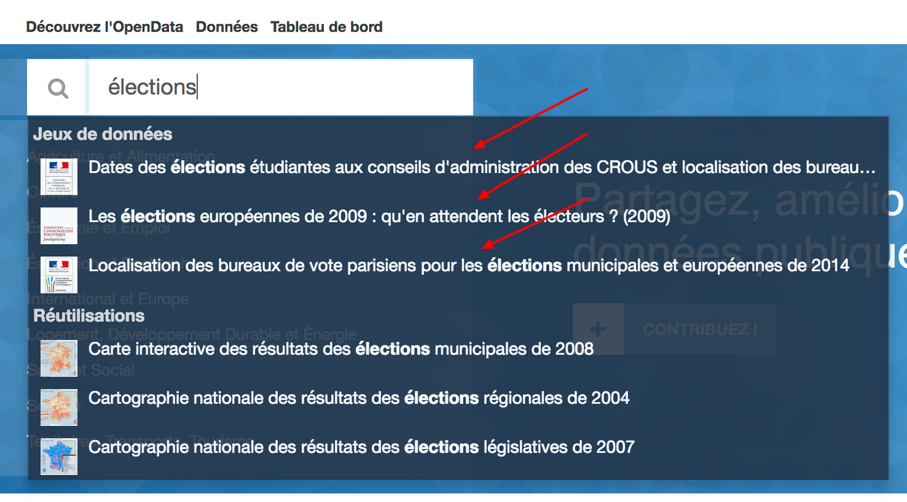
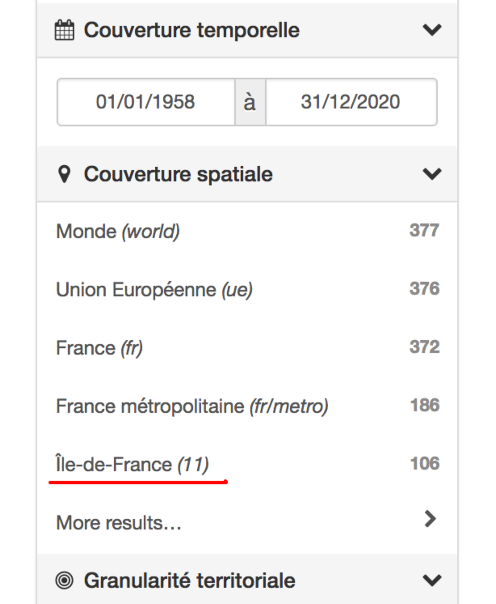
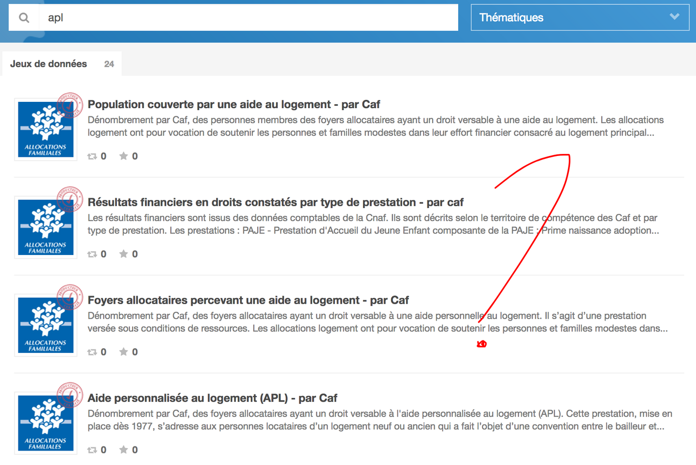
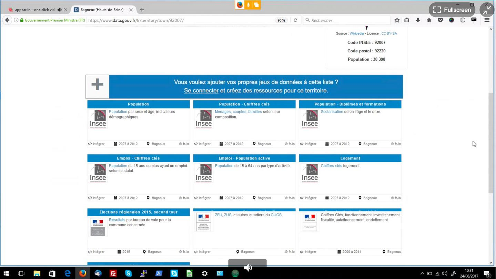
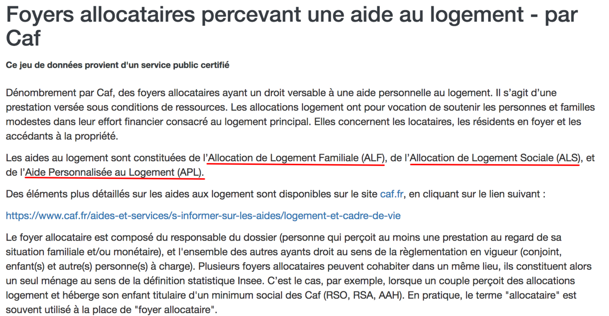
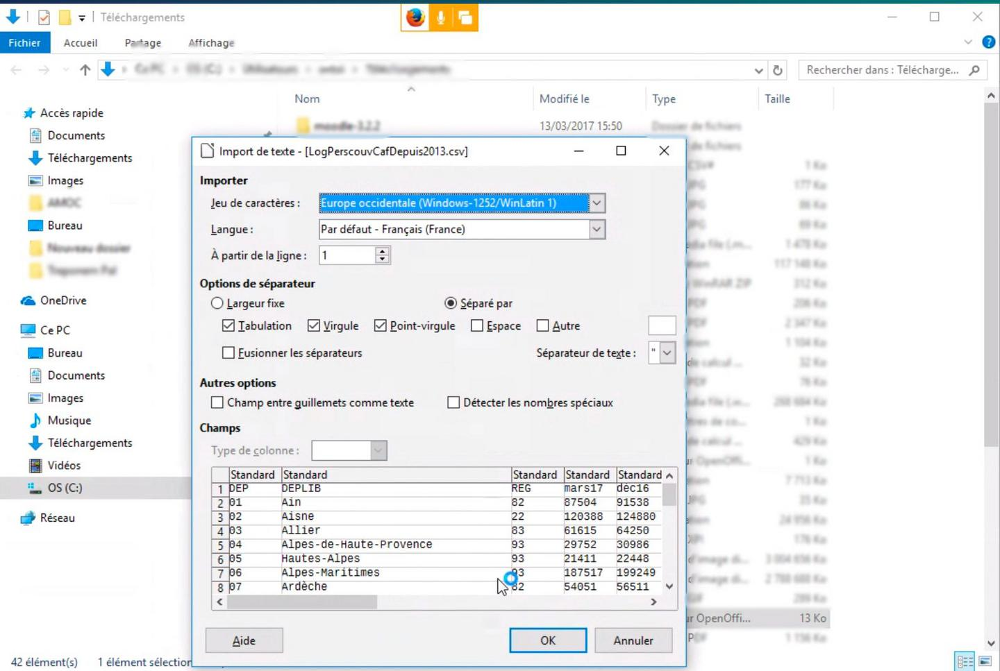
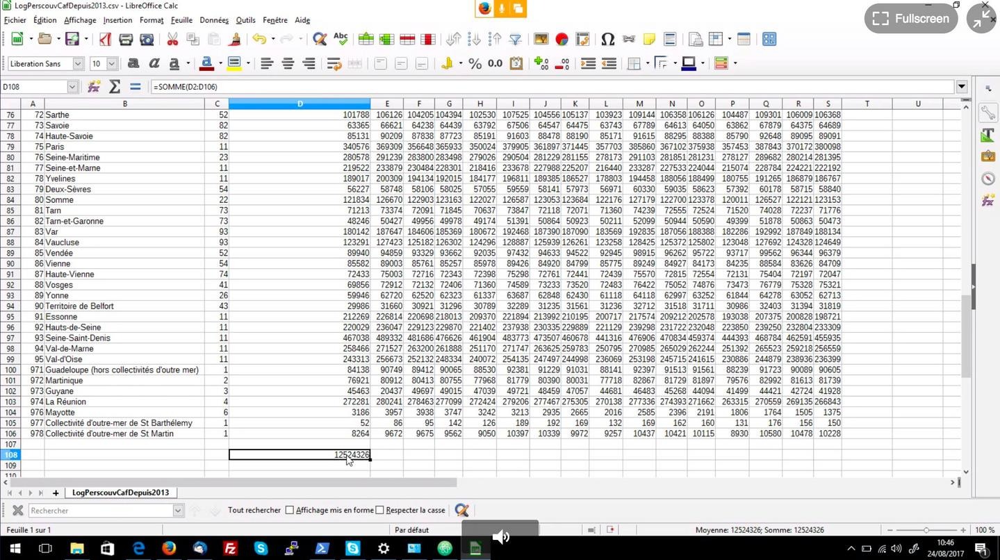
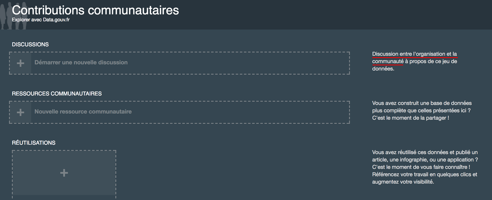

# Entretien avec Antoine Sirven

## Présentation

J'ai fait une formation en informatique en 1998 puis je me suis orienté vers le web par choix, c'était nouveau et ça correspondait à mes aspirations. Sinon j'étais plutôt orienté back-office, genre Java etc.

J'ai travaillé dans des startups, dans des grosses boites puis je me suis retrouvé à gérer des gens avec des feuilles Excel. C'était ennuyeux.

Il y a 3 ans j'ai changé de secteur, je me suis orienté vers la _formation pour les métiers de la musique_ ; ça n'a rien à voir. **Maintenant je programme pour le plaisir**. J'ai un _focus_ sur la démarche, sur le logiciel libre et le partage de connaissances.

J'ai découvert le travail d'Etalab par hasard, sur Twitter je crois, lors des élections municipales de 2014. Quelqu'un avait partagé un jeu de données ou une réutilisation, je ne sais plus. **J'ai beaucoup aimé la démarche**.

Je suis retourné sur data.gouv.fr lors du premier tour des élections présidentielles de 2017, **pour voir le résultats des élections de ma commune et des villes alentours**.

## Thématique • Découverte des données

💡 Lors du débat sur la [baisse de 5€ des Aides Personnalisées au Logement (APL)](http://www.lemonde.fr/societe/article/2017/08/03/le-gouvernement-auto-piege-par-la-baisse-de-5-euros-des-apl_5168190_3224.html), j'ai eu envie de comparer l'économie réalisée avec le [possible cadeau fiscal de la réforme de l'Impôt Sur la Fortune](https://www.mediapart.fr/journal/france/100817/reforme-de-l-isf-l-imposture-du-financement-de-l-economie?onglet=full).

🗣 C'était avant tout pour ma culture personnelle, pas dans le but de créer une réutilisation.

---

> J'ai commencé par chercher des jeux de données sur le domaine de la _culture_, parce que c'est **mon domaine d'activité**.

> Au début je me baladais pas mal grâce aux **jeux de données mis en avant**. Ça me permettait de découvrir et de comprendre l'étendue des informations que je pouvais trouver.

> J'ai aussi fait quelques recherches mais rien de concluant. Par exemple, le **montant reversé par les organisations de concerts à l'État**.

> J'ai aussi cherché s'il y avait des données publiées par le [Syndicat National de l'édition Phonographique (SNEP)](http://www.snepmusique.com/), par exemples les **ventes de disques** ou les données permettant la publication des [**bilans annuels du marché de la musique enregistrée**](http://www.snepmusique.com/actualites-du-snep/bilan-2016-marche-de-la-musique-enregistree/).

🗣 Je me suis dis : est-ce que je peux **trouver d'autres données pour contrebalancer** cette voix unique ?

> Je n'ai rien trouvé mais avec le recul, c'est normal car c'est un marché un peu fermé.
> Au mieux je pourrais trouver des informations sur les _subventions publiques_ (telles que [les crédits d'impôt](http://www.culturecommunication.gouv.fr/Thematiques/Industries-culturelles/Musique-enregistree/Le-credit-d-impot-en-faveur-de-la-production-phonographique)) ou les _concerts_ mais ça n'était pas le sujet à l'époque de mes recherches.

🗣 J'ai vu des jeux de données mais ils ne m'ont pas forcément captivé. Alors je me suis **rabattu sur les données des élections**, car c'était la période, j'étais impliqué au niveau local et je savais qu'il y avait des choses à ce niveau.

---

🗣 J'avais vu les _dernières réutilisations_. C'est intéressant que ça soit mis en avant car **je n'avais pas imaginé voir le travail d'autres personnes, autres que les administrations publiques**.

👍 J'apprends par l'exemple, en regardant ce que d'autres ont fait. C'est bien, **ça donne des idées**. Je visite une réutilisation, puis sa source.

🗣 Je sélectionne les réutilisations **pour apprendre** ou **par curiosité pour une thématique en particulier**.

🤔 Par contre dès que je vois des termes trop techniques, ça me fait décrocher, et je laisse tomber.

---

> Je pensais que c'était un lieu de mise à disposition des données, du gouvernement vers les citoyens et autres entités publiques. Uniquement descendant en somme. **J'ai mis du temps à comprendre que c'était un lieu de partage**.

> C'est lié au fait que ma première rencontre avec la plate-forme data.gouv.fr s'est faite en atterrissant sur la page d'un jeu de données. **Je n'avais pas vu l'encadré des contributions communautaires**.

---

🤔 Tiens, je ne sais pas où j'ai cliqué mais ça a lancé la recherche ?

---

👍 La _complétion automatique_ m'a permis de voir l'étendue de que je pouvais trouver sur data.gouv.fr

---

🤔 Une fois je suis tombé sur la base des codes postaux mais je ne vois pas ce que j'aurais pu en faire. Peut-être pour faciliter l'autocomplétion d'une adresse postale un jour ?

---

🗣 Je souhaite chercher les résultats des élections municipales de 2014 en Île-de-France (car où j'habitais, à ce moment là).

🔍 "[élections municipales](https://www.data.gouv.fr/fr/search/?q=%C3%A9lections+municipales)"

1. 👉 Je clique sur la facette `Organisations > Région Île-de-France`  

2. 👉 Je clique sur 🔗 "[Élections municipales 2014 - Les candidats du 2e tour (communes de 1000 hab. et plus)](https://www.data.gouv.fr/fr/datasets/elections-municipales-2014-les-candidats-du-2e-tour-communes-de-1000-hab-et-plus-idf/)"

⁉️ C'est quoi la différence avec `Couverture spatiale > Île-de-France` ? Je suis confus là.

💬 Quand j'ai initialement cliqué sur `Région Île-de-France`, je pensais à la _couverture spatiale_, par à l'_organisation_ du même nom.

💬 Je suis davantage intéressé par la **diversité des producteurs de données proches de chez-moi** que par une institution en particulier.

> Je n'entends pas obtenir des données publiées _par_ ma ville mais couvrant le territoire de ma ville.

---

❓ Les _badges_ dans les facettes ? Je ne sais pas à quoi ils correspondent.

🤔 Les _licences_ dans les facettes ? Je ne les connais pas toutes, ni les subtilités qui les différencient.

🤔 Les _tags_ dans les facettes ? Je n'en vois pas l'utilité à cet endroit.

👍 Les _formats_ dans les facettes ? Pour filtrer sur les fichiers CSV certainement.

---

🔍 "[Bagneux](https://www.data.gouv.fr/fr/search/?q=bagneux)"

> Pour voir les données qu'il y a proche de chez moi.

❓ L'onglet `Territoires` ? Je ne l'avais pas vu. Je n'aurais pas cliqué si tu ne m'en avais pas parlé.

---

🔍 "[APL](https://www.data.gouv.fr/fr/search/?q=apl)"

😤 J'avoue ne pas trop savoir quel jeu de données choisir.

## Thématique • Compréhension des données

🔗 "[Bagneux](https://www.data.gouv.fr/fr/territory/town/92007/)"

❓ C'est une fiche pour la ville de Bagneux ? Pas très utile, non ?

👍 Ah, on voit les jeux de données associés. C'est bien pour connaître le maillage territorial.

---

🔗 "[Foyers allocataires percevant une aide au logement - par Caf](https://www.data.gouv.fr/fr/datasets/foyers-allocataires-percevant-une-aide-au-logement-par-caf/)"

👍 La description, je l'ai lu en diagonale mais ça m'a permis d'apprendre qu'il y avait d'autres aides que les APL.

👀 J'ai regardé notamment les `Date de création` et `Date de modification`.

❓ La `Dernière mise à jour de ressource` ? J'avoue ne pas en comprendre le sens.

💬 Ce qui m'intéresse c'est **savoir de quoi on parle**, de **quand datent les données qu'on va manipuler** ; **leur fraicheur**.

## Thématique • Utilisation des données

> **J'utilise principalement les fichiers tabulaires** (CSV, Excel) avec LibreOffice.
> J'applique des filtres et formules.

> Aussi, je me limite à des jeux de données simples et à des opérations simples car je ne suis pas forcément un cador en statistiques. Tout seul je ne pense pas pouvoir faire des choses trop poussées.

> Dans un second temps, je m'essaye à Python et éventuellement des données au format JSON mais c'est **quand j'ai davantage de temps**.

> Quand je pars en tournée, je sais que je vais avoir de nombreuses heures de route donc je télécharge des jeux de données d'avance, pour **travailler dessus hors-ligne**.

---

> Comme je travaille souvent sur des jeux simples avec peu de colonnes, LibreOffice s'en est toujours sorti.

🙃 J'ai déjà eu des problèmes mais c'était lié aux données elles-mêmes.

---

> Quand j'ouvre un jeu de données avec LibreOffice, je fais 2 choses :

1. vérifier l'encodage (là, ça a l'air d'aller) ;
2. la tête des colonnes.

---

🔗 "[Foyers allocataires percevant une aide au logement - par Caf](https://www.data.gouv.fr/fr/datasets/foyers-allocataires-percevant-une-aide-au-logement-par-caf/)"

😤 L'ennui avec ce jeu de données c'est qu'il y a plusieurs types d'aides (ALF, ALS et APL) mais on ne peut pas les distinguer au sein même du jeu de données.

🤔 Il y a des chances que mes analyses soient erronées donc.

❓ Si je peux contacter la Caf pour leur demander de faire le distingo des catégories ? Non, je ne pense pas que ça soit faisable : si je vais sur leur site, je vais avoir affaire aux personnes qui gèrent les assurés.

❓ Si j'avais vu la partie _discussions communautaires_ ? Ah non, pourtant c'est écrit quand on y prête attention. **Je pensais que c'était juste entre visiteurs du site**.

🤔 Il y a vraiment quelqu'un en face dont c'est la tâche au quotidien de répondre à ces questions ? J'avoue avoir un doute.

## ROTI • Retour sur Temps Investi

👍 Avoir cet entretien m'a donné envie d'explorer le site à nouveau, et de voir d'autres réutilisations.

👍 C'est vraiment chouette d'avoir accès à toutes ces données ; **super initiative**.