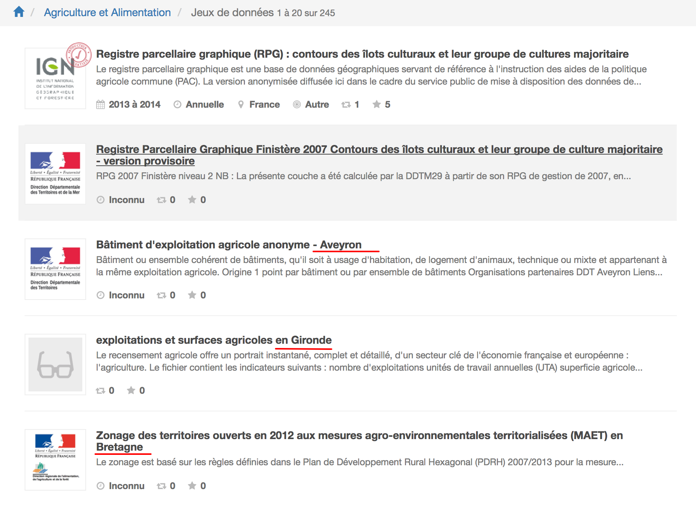
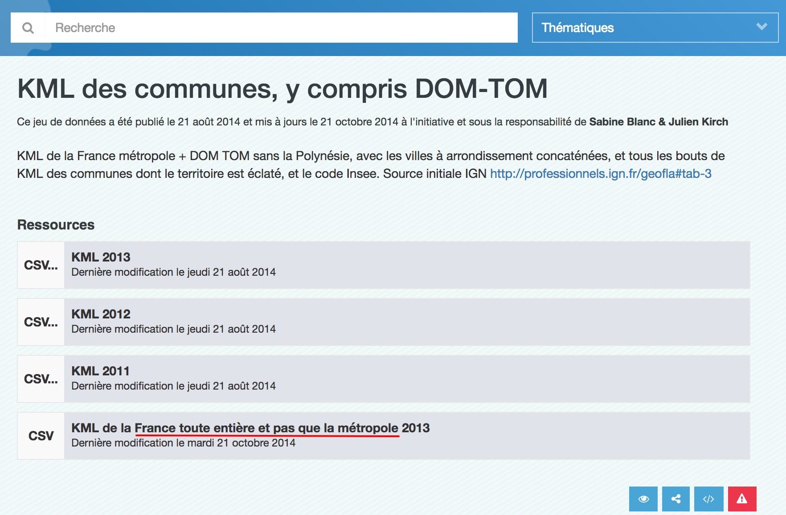
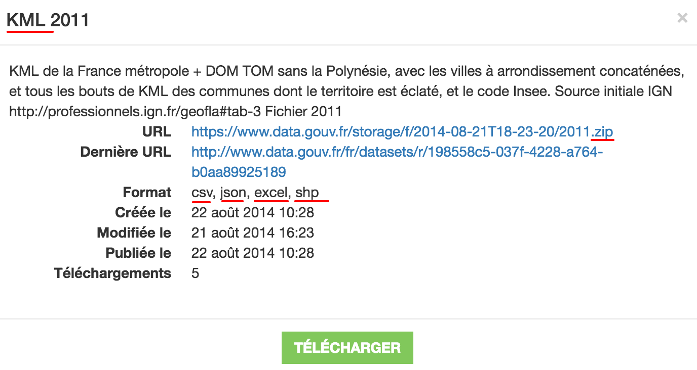

# Entretien avec Alexiane Lerouge

## Présentation

Je suis datajournaliste à la rédaction d'Alternatives Économiques. Après y avoir fait mon alternance pendant mes études de journalisme, aujourd'hui c'est mon premier jour en CDD ! 🎉

J'ai appris l'aspect _data_ du journalisme entre autres lors d'une formation avec [journalism++](http://jplusplus.org) et leur module de formation [jquest](https://github.com/jplusplus/jquest).

Au quotidien, je travaille avec un autre développeur et s'épaule sur le duo _data_ et _contenus_. On est fortement soutenu par le rédacteur en chef.

## Thématique • Découverte des données

> _data.gouv.fr_ n'est pas forcément mon portail d'entrée. **J'y vais quand on ne sait pas où chercher, par où commencer**.

🗣 En général, je pars à la recherche de données de 2 manières :

1. **en allant directement à la source** — on est un journal spécialisé, c'est une manière de procéder qu'on privilégie ;
2. **en effectuant une recherche sur Google** — en utilisant l'opérateur `filetype:csv`, souvent.

---

> En général, **on part d'une idée qu'on essaye d'illustrer avec des données**. C'est rare d'opter pour la position inverse.

---

🗣 Parmi nos publications, on a « _Les Chiffres_ ». On actualise ces publications chaque année, et on y traite différentes _thématiques_.
En fonction des thématiques, on sait vers quelle(s) source(s) se tourner pour effectuer les mises à jour.

🔗 "[L’apprentissage en 2016](http://dares.travail-emploi.gouv.fr/dares-etudes-et-statistiques/etudes-et-syntheses/dares-analyses-dares-indicateurs-dares-resultats/article/l-apprentissage-en-2016)"

⬇️ "[Données à télécharger _l'apprentissage en 2016_](http://dares.travail-emploi.gouv.fr/IMG/xls/donnees_a_telecharger-_dr_no057.xls)"

> Si je trouve des informations sur le _salaire moyen des apprentis_ dans ce jeu de données, j'irais chercher _salaire moyen_ sur _data.gouv.fr_.

💬 Je cherche des données **pour mettre en perspective** celles que j'ai déjà.

---

😤 Je me suis cassé les dents sur les _thématiques_.

🗣 Prenons par exemple, si je cherche des données sur l'emploi spécifique à l'agriculture.

🤔 Je choisis quoi ? Agriculture et Alimentation ? Économie et Emploi ? **Beaucoup de nos sujets sont des sujets transverses** (travail, social, dépenses publiques, environnement). D'ailleurs les dépenses publiques concernent _toutes_ les thématiques listées…

👉 [Agriculture et Alimentation](http://www.data.gouv.fr/fr/topics/agriculture-et-alimentation/)
👉 [Voir plus ➡️ Datasets](http://www.data.gouv.fr/fr/topics/agriculture-et-alimentation/datasets)

😤 Une de mes plus grosses frustrations c'est l'**absence de hiérarchie** dans les résultats. Ça peut être très chaotique ; ça dépend de l'activité dans les régions. Des fois ils floodent !

💬 Je sais que c'est un portail qui agrège des données d'autres portails mais **je m'attends à trouver en premier lieu des jeux à couverture nationale**.

## Thématique • Compréhension des données

🗣 Une des premières choses que je fais pour savoir **si la ressource est celle que je cherche**, c'est de la _télécharger_ et de regarder son contenu.

> Des fois je me perds car je télécharge plusieurs ressources à la suite — sans les ouvrir — et je ne sais plus à quoi elles correspondent.

---

🤔 Parfois les titres des jeux de données et/ou des ressources sont bizarres.

🔗 "[KML des communes, y compris DOM-TOM](http://www.data.gouv.fr/fr/datasets/kml-des-communes-y-compris-dom-tom/)"

> Ça va vraiment varier d'une source de données à une autre. Ça peut aller du très (trop) précis à des cas loufoques comme celui-là — ça me fait penser à quelqu'un qui envoie un email à la va-vite.

🤔 D'ailleurs, les informations de _type de fichier_ ne sont pas cohérentes dans la popup.

## Thématique • Utilisation des données

## Conclusion

## ROTI • Retour sur le Temps Investi