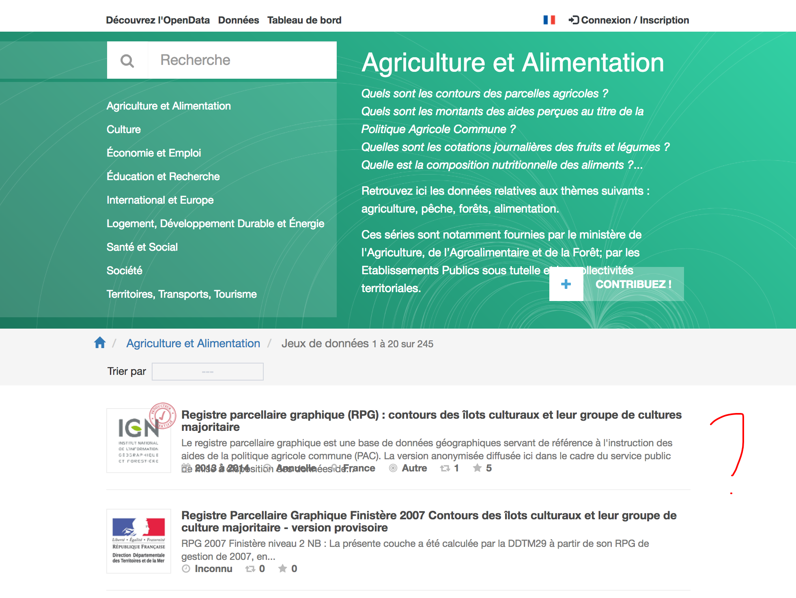
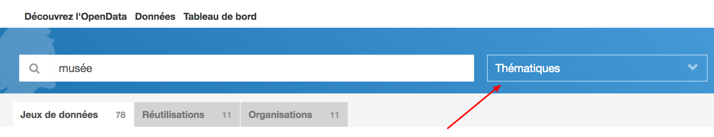
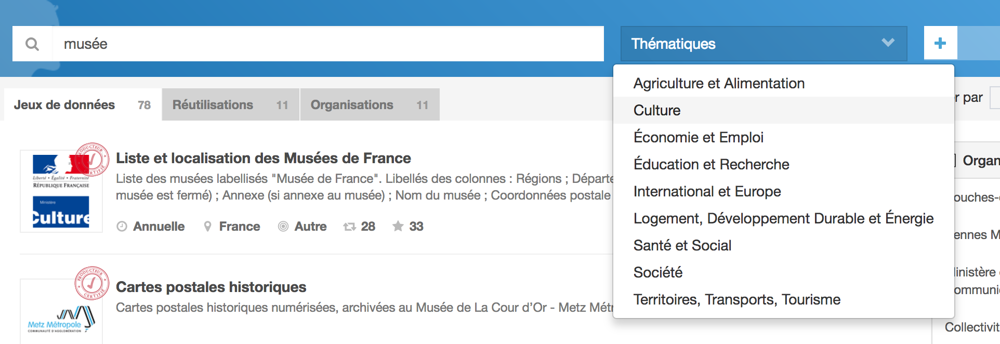
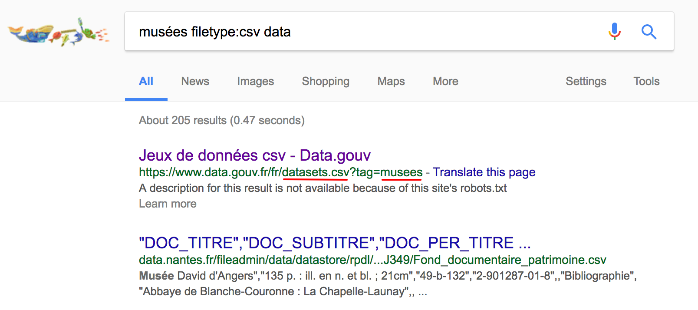
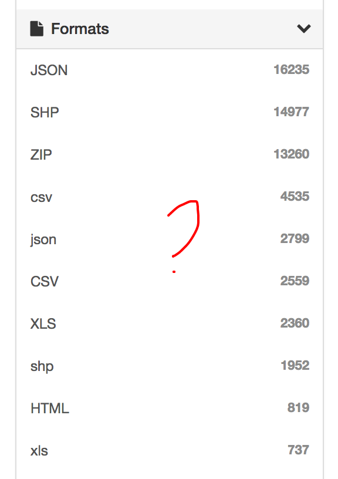

# Entretien avec Alexiane Lerouge

## Présentation

Je suis datajournaliste à la rédaction d'Alternatives Économiques. Après y avoir fait mon alternance pendant mes études de journalisme, aujourd'hui c'est mon premier jour en CDD ! 🎉

J'ai appris l'aspect _data_ du journalisme entre autres lors d'une formation avec [journalism++](http://jplusplus.org) et leur module de formation [jquest](https://github.com/jplusplus/jquest).

Au quotidien, je travaille avec un autre développeur et s'épaule sur le duo _data_ et _contenus_. On est fortement soutenu par le rédacteur en chef.

## Thématique • Découverte des données

> _data.gouv.fr_ n'est pas forcément mon portail d'entrée. **J'y vais quand on ne sait pas où chercher, par où commencer**.

🗣 En général, je pars à la recherche de données de 2 manières :

1. **en allant directement à la source** — on est un journal spécialisé, c'est une manière de procéder qu'on privilégie ;
2. **en effectuant une recherche sur Google** — en utilisant l'opérateur `filetype:csv`, souvent.

---

> En général, **on part d'une idée qu'on essaye d'illustrer avec des données**. C'est rare d'opter pour la position inverse.

---

🗣 Parmi nos publications, on a « _Les Chiffres_ ». On actualise ces publications chaque année, et on y traite différentes _thématiques_.
En fonction des thématiques, on sait vers quelle(s) source(s) se tourner pour effectuer les mises à jour.

🔗 "[L’apprentissage en 2016](http://dares.travail-emploi.gouv.fr/dares-etudes-et-statistiques/etudes-et-syntheses/dares-analyses-dares-indicateurs-dares-resultats/article/l-apprentissage-en-2016)"

⬇️ "[Données à télécharger _l'apprentissage en 2016_](http://dares.travail-emploi.gouv.fr/IMG/xls/donnees_a_telecharger-_dr_no057.xls)"

> Si je trouve des informations sur le _salaire moyen des apprentis_ dans ce jeu de données, j'irais chercher _salaire moyen_ sur _data.gouv.fr_.

💬 Je cherche des données **pour mettre en perspective** celles que j'ai déjà.

> Si on sait déjà que la donnée se trouve chez un producteur de données, pourquoi irai-je sur data.gouv.fr ? Je n'y vois pas assez de valeur ajoutée.

---

😤 Je me suis cassé les dents sur les _thématiques_.

🗣 Prenons par exemple, si je cherche des données sur l'emploi spécifique à l'agriculture.

🤔 Je choisis quoi ? Agriculture et Alimentation ? Économie et Emploi ? **Beaucoup de nos sujets sont des sujets transverses** (travail, social, dépenses publiques, environnement). D'ailleurs les dépenses publiques concernent _toutes_ les thématiques listées…

1. 👉 [Agriculture et Alimentation](http://www.data.gouv.fr/fr/topics/agriculture-et-alimentation/)
1. 👉 [Voir plus ➡️ Datasets](http://www.data.gouv.fr/fr/topics/agriculture-et-alimentation/datasets)

😤 Une de mes plus grosses frustrations c'est l'**absence de hiérarchie** dans les résultats. Ça peut être très chaotique ; ça dépend de l'activité dans les régions. Des fois ils floodent !

💬 Je sais que c'est un portail qui agrège des données d'autres portails mais **je m'attends à trouver en premier lieu des jeux à couverture nationale**.

> **J'ai du mal à comprendre comment les données sont compilées** (qu'est-ce qui influence le tri ?) et **comment elles sont hiérarchisées** (pas de national vers local en tous cas).

---

> Mon outil de recherche favori c'est vraiment Google avec l'opérateur `filetype:csv`.

❓ Si je savais que je pouvais filtrer par type CSV sur data.gouv.fr ? Ah non, on peut ?

😤 Les facettes n'apparaissent pas car ma fenêtre de navigateur est "trop petite".

💬 J'ai l'habitude d'avoir **2 fenêtres côte à côte** : Excel et un navigateur Web…

❓ Et si j'avais remarqué les options de tri de résultats ? Ah non…

🤔 C'est quoi `Trier par date de création` ?

😤 C'est pas très utile `date de création` ; la `date de couverture` m'intéresse en revanche.

---

Sur un sujet donné, je vais chercher des données. Imaginons qu'il y ait 2 résultats, que ce sont des séries et qu'ils s'affichent dans cet ordre :

1. Dataset couvrant de 2010 à 2012 ;
2. Dataset couvrant de 2014 à 2016.

💬 Et bien je préfèrerais avoir `2014 à 2016` en premier car 2016 est plus proche de _maintenant_ (2017).

💬 Le constat est qu'un **tri par fraicheur** est plus utile, du plus récent au plus ancien.

🤔 Aujourd'hui j'ai l'impression que c'est la `date de publication` qui prime sur la `date de couverture`.

💬 Je ne m'intéresse pas à _quand_ date les modifications mais aux **dates couvertes par les jeux de données**.

🤔 Et encore, je ne suis pas vraiment sûre de la signification de `date de création`.

---

> Ah d'ailleurs c'est pénible ce bouton `Contribuer`, je veux juste **rentrer dans les données**.

---

1. Depuis la page d'accueil ;
2. 👉 [thématique "Culture"](https://www.data.gouv.fr/fr/topics/culture/) ;
3. 🔍 "[musée](https://www.data.gouv.fr/fr/search/?q=mus%C3%A9e)" ;

🤔 Ah, la thématique n'est plus sélectionnée dans la boite déroulante…

4. 👉 [thématique "Culture"](https://www.data.gouv.fr/fr/topics/culture/)

😤 Ça me ramène sur la page culture _et_ ça efface ma recherche…

> Quand j'en ai marre de me prendre des claques comme ça, je vais sur Google et je tape `filetype:csv musées data`.

😅 Ah drôle, c'est data.gouv.fr qui ressort en premier.

---

🗣 Je voulais écrire un papier sur les [300 000 emplois CICE clamés par Pierre Gattaz](https://www.alternatives-economiques.fr/cice-curieux-chiffres-de-monsieur-gattaz/00080269).

⚠️ passage incomplet ⚠️

## Thématique • Compréhension des données

🗣 Une des premières choses que je fais pour savoir **si la ressource est celle que je cherche**, c'est de la _télécharger_ et de regarder son contenu.

> Des fois je me perds car je télécharge plusieurs ressources à la suite — sans les ouvrir — et je ne sais plus à quoi elles correspondent.

---

🤔 Parfois les titres des jeux de données et/ou des ressources sont bizarres.

🔗 "[KML des communes, y compris DOM-TOM](http://www.data.gouv.fr/fr/datasets/kml-des-communes-y-compris-dom-tom/)"

> Ça va vraiment varier d'une source de données à une autre. Ça peut aller du très (trop) précis à des cas loufoques comme celui-là — ça me fait penser à quelqu'un qui envoie un email à la va-vite.

🤔 D'ailleurs, les informations de _type de fichier_ ne sont pas cohérentes dans la popup.

---

❓ Comment peut-on réutiliser une réutilisation ?

❓ A-t-on le droit de dériver les réutilisations ?

🤔 C'est pas clair ce qu'on peut en faire.

> Je pense notamment à cette cartographie de la malbouffe en France qu'on peut voir en page d'accueil de data.gouv.fr.

🔗 "[Obésité, Fastfoods, Alcool... : Où mange-t-on le plus mal en France ?](https://www.data.gouv.fr/fr/reuses/obesite-fastfoods-alcool-ou-mange-t-on-le-plus-mal-en-france/)"

---

> Des fois on aimerait que certains jeux de données **aillent plus loin dans le temps** et que d'autres **soient actualisés sur des plages plus récentes**.

🗣 Mais peut-être qu'on ne le voit pas à cause de la hiérarchisation bizarre des résultats de recherche.

---

🗣 À terme on va vouloir produire **davantage de cartes** donc on va avoir besoin de davantage de données cartographiques.

🤔 Ah tiens, **on ne peut pas trouver les fichiers KML**

🔗 "[Jeux de données](https://www.data.gouv.fr/fr/datasets/)"

---

🗣 Je regarde plusieurs choses m'intéressent dans un jeu de données :

- le type de données ;
- parfois le titre, parfois pas ;
- la temporalité ;
- pas la couverture non, j'ai déjà trié par couverture ;
- et la granularité, ça dépend des fois.

## Thématique • Utilisation des données

> Pour les fichiers KML, j'ai pris l'habitude d'utiliser CartoDB.

➡️ [CARTO](https://carto.com/)

> Sinon j'utilise principalement Excel — ou Google Spreadsheet quand il faut travailler à plusieurs.

> Pour joindre des données, j'utilise le bon vieux _Fusion Table_.

➡️ [Fusion Table](https://support.google.com/fusiontables/answer/2571232)

> En ce moment j'apprends Python Pandas.

---

😤 Le pire dans un jeu de données c'est quand il n'y a pas de clé, comme un code INSEE par exemple.

😤 Quand il faut joindre des prénoms et des noms, bonjour les homonymes !

---

❓ On voudrait se connecter à data.gouv.fr pour utiliser les données en direct, _on peut_ ? On va faire pareil avec eurostats et l'INSEE.

💬 C'est pour faire des tableaux de bord avec les données générales de l'économie en France :

- taux de chômage ;
- PIB ;
- taux de croissance ;
- etc.

## Conclusion

> C'est bien qu'on s'intéresse à nos usages, et si ça peut permettre d'améliorer la plate-forme.