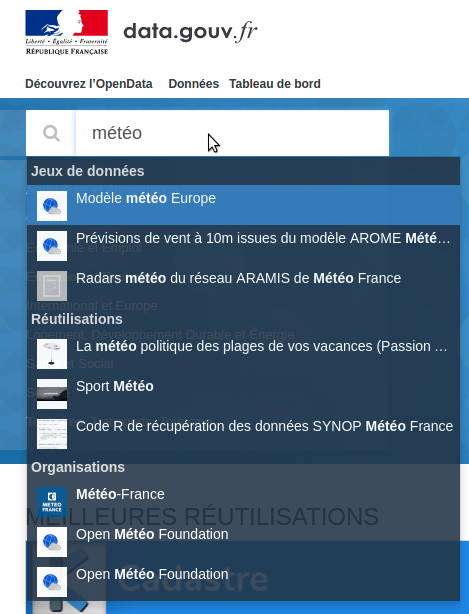

# Entretien avec Philippe Blayo

## Présentation

Je suis développeur sur udata. Je n'avais pas d'expérience de data.gouv.fr avant d'arriver à Etalab. J'y étais allé une ou deux fois pour voir et j'avais lu quelques articles.

🗣 En revanche j'ai une expérience de l'utilisation des données ouvertes du parlement Européen par l'intermédiare d'un regroupement d'associations non gouvernmentales qui tentent de suivre les votes des députés européens :
- les différences entre ce qu'il ont promis et leurs votes
- l'influence de leur passé et de leurs affiliations sur leurs votes

Mon constat est que ces membres d'ONG ne sont pas du tout en mesure d'utiliser des données ouvertes. Il ont absoluement besoin d'une intermédiation (souvent un développeur) :
🗣 Ce n'est pas parce-que les données sont disponibles qu'elles sont utilisables.

## Thématique • Recherche de données

🔍 météo

Je cherche un historique de températures et de précipitations.
La complétion m'affiche des propositions qui ne me parlent pas :
- modèle ? Pourquoi on me parle de modèle ?
- prévision : je cherche des données du passé pas des prévisions du futur.
- Aramis, Radars ? C'est quoi ?
Dans les réutilisations je vois :
- Sport Météo : en quoi est-ce utile ?
- Du code R : ça c'est utile, ça pourrait m'aider (d'ailleurs je n'aurais pas penser à le chercher)

J'appuie sur la touche retour chariot pour voir le résultat complet de la recherche.

🤔 la complétion reste affichée, c'est bizarre.

Le 7ème résultat est "Pluviométrie d'altitude dans les Alpes". La pluviométrie, c'est bien ce que je recherche, mais ce n'est que dans les Alpes alors que je recherche des données plus nationales.

Conclusion de cette recherche : c'est complexe de rechercher des données.

## Thématique • Comprendre un jeu de données

A retranscrire.

## Conclusion

😊 Je suis content d'avoir fait ces tests utilisateurs. Je me sens utile. La présence silencieuse d'une autre personne à mes cotés m'a même permis d'aller plus loin sur un jeu de donnée où j'avais jeté l'éponge. Cette présence silencieuse et bienveillante d'une personne à mes cotés me permet souvent de me débloquer, je ne sais pas pourquoi j'en suis encore surpris.
