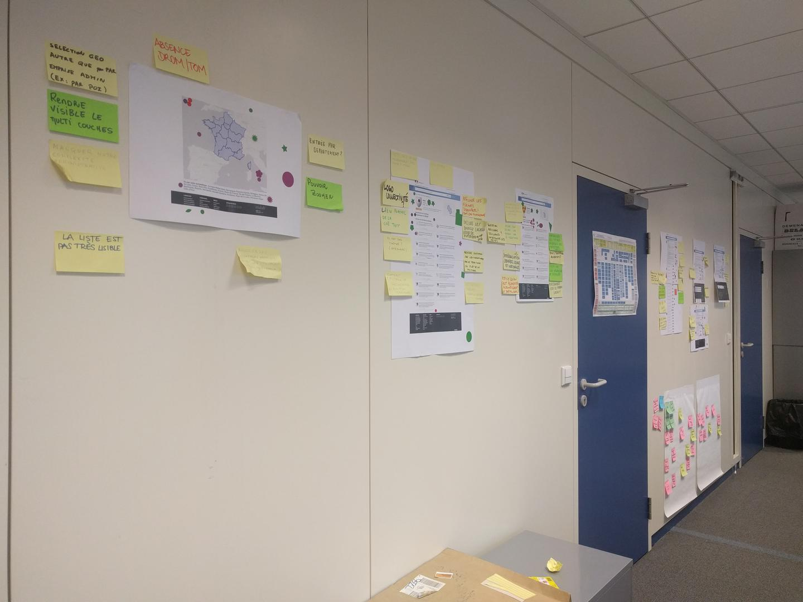
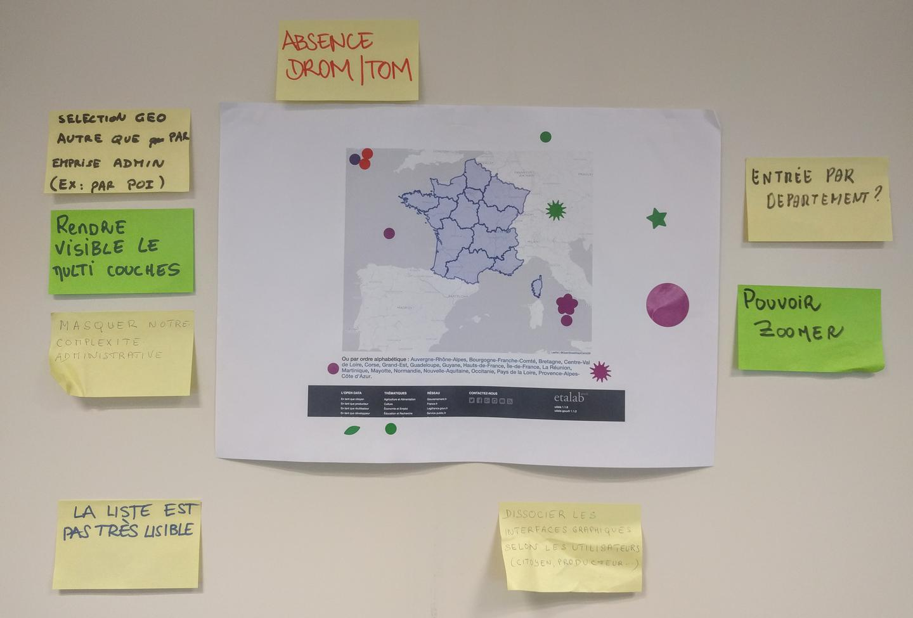
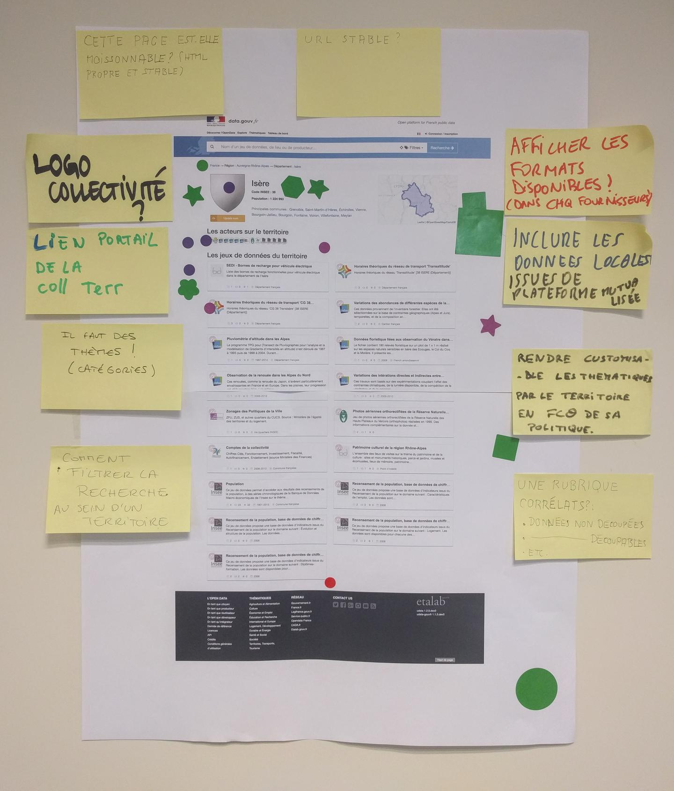
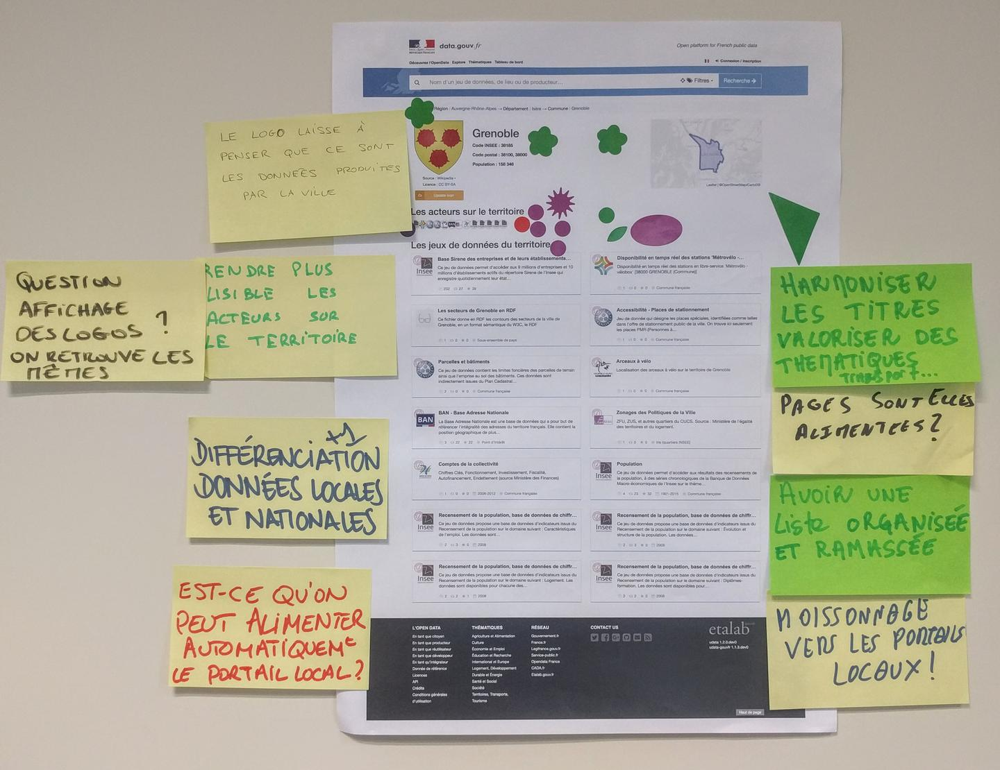
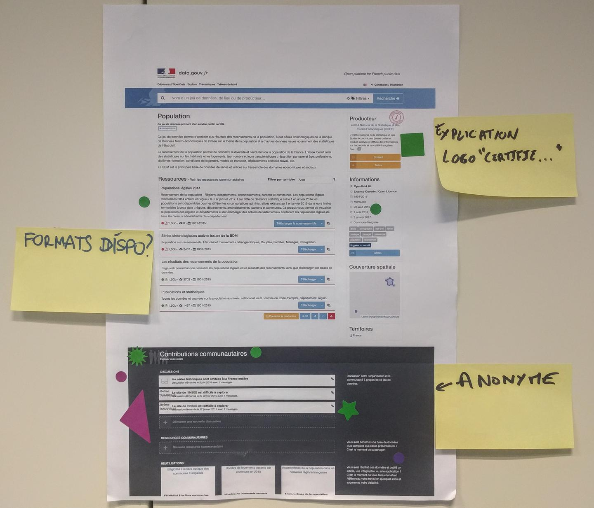
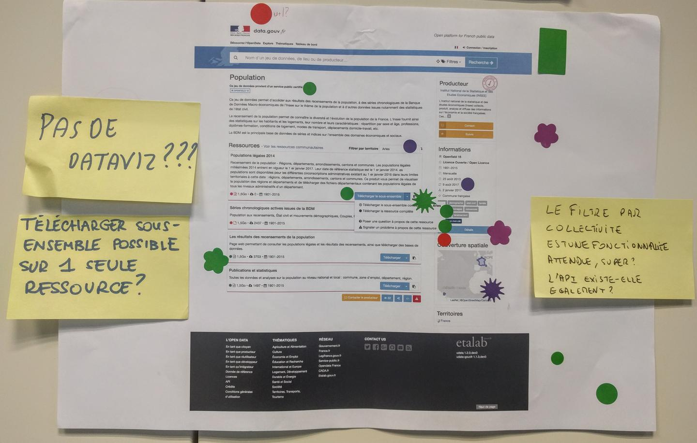
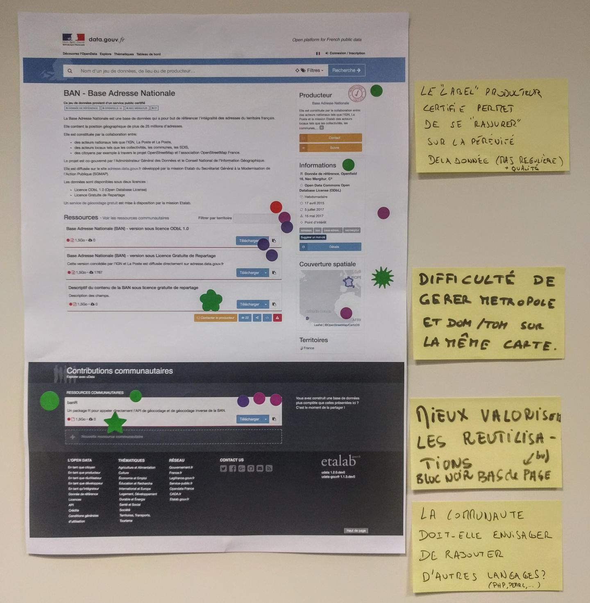
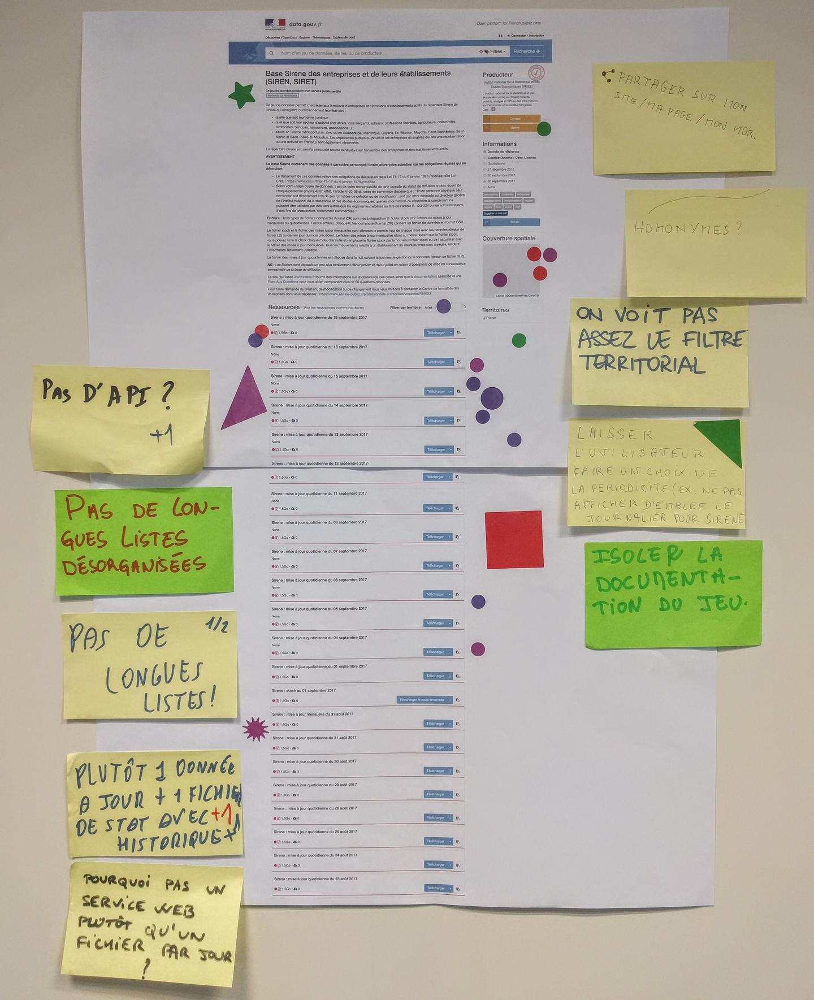

# Workshop « prototype de téléchargement de sous-ensemble géographique »

# Règles et organisation

1. 5 minutes pour se lever et les regarder, en silence
2. 5 minutes pour mettre des gommettes
  - **VERT** • Chouette ! Ça répond à mes besoins !
  - **VIOLET** • Ça m'interroge. Je ne comprends pas. J'ai une question.
  - **ROUGE** • Ca me gêne. Mon boss ne sera pas content.
3. 5 minutes pour regarder, se poser des questions
4. Les post-its ça marche comment ?
4. 15 minutes pour écrire des idées, questions et les placer où ça vous chante
5. 30-40 minutes (ou plus) où on en parle
	- présentation du bâton de parole
	- un post-it = 5 minutes
	- au bout de 5 minutes on décide ensemble si on continue ou on passe à un autre sujet
6. https://github.com/etalab/user-research
7. ROTI !
8. Merci 🙂

# Contributions

## Écran « Index Territoires »

## Écran « Territoire • Département »

## Écran « Territoire • Commune »

## Écran « Dataset • Téléchargement de sous-ensemble »

### Variante : fonctionnalité disponible (dropdown fermée)

### Variante : fonctionnalité disponible (dropdown ouverte)

### Variante : fonctionnalité indisponible

### Variante : fonctionnalité disponible (nombreuses ressources)

[data.gouv.fr]: https://www.data.gouv.fr/
